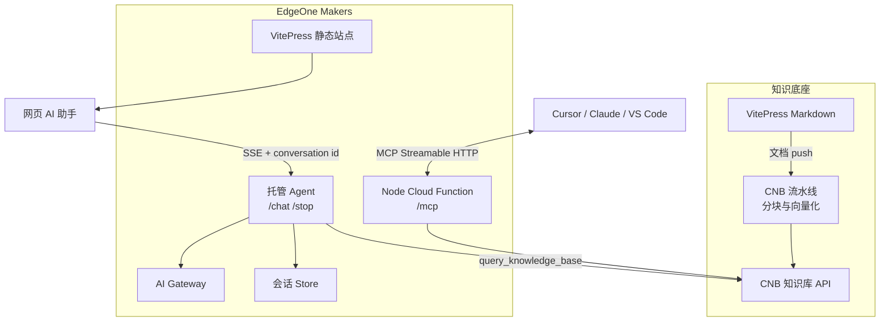

# 架构全景图

本项目以 **CNB 知识库为统一检索底座**，在 EdgeOne Makers 中分别托管标准 MCP 服务与网页端 Agent。

## 当前架构

## 数据流

1. Markdown 更新触发 CNB 流水线，文档被分块并写入知识库。
2. 外部 AI 工具通过 `/mcp` 调用路径级 Node Cloud Function 中的知识库工具。
3. 网页组件调用 `/chat`，并在请求头携带 `makers-conversation-id`。
4. Makers 将 AI Gateway、`context.store`、中止信号与观测能力注入 Agent 运行时。
5. Agent 自主调用 `query_knowledge_base`，再将 `ai_response` 等 SSE 事件流式返回前端。

## 职责边界

- **CNB**：文档向量化、知识库存储和语义查询。
- **Node Cloud Function**：精确映射 `/mcp`，实现标准 MCP 协议且不承担模型推理。
- **Makers Agent**：模型推理、知识库工具调用、多轮会话、SSE 和停止运行。
- **前端组件**：交互与渲染，不再手工编排 Function Calling 或拼接历史消息。

## 为什么这样拆分

MCP 是面向外部客户端的协议入口，路径级 Node Function 不会接管静态站点路由；网页问答需要模型、会话与流式运行，放进 Makers Agent 能直接使用平台托管能力。两者共享 CNB 知识库，但各自只有一个明确职责。
