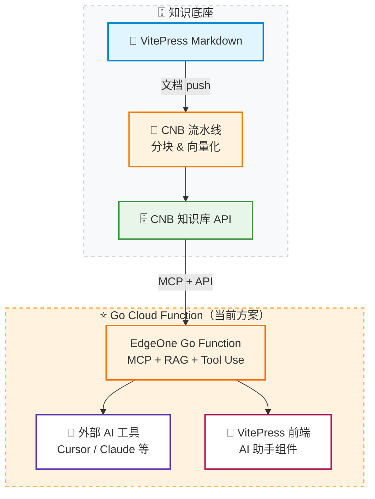

# 架构全景图

本项目核心是：**以 CNB 知识库为统一检索底座**，通过 Go Cloud Function 向上提供 MCP 端点和网页端 AI 助手。

## 当前架构

::: details 📜 历史架构：早期分开部署方案
由于 EdgeOne Pages 早期仅支持 JS Cloud Function，本项目最初将功能拆分为两种独立方案：

- **方案一（JS MCP）**：用 JS 边缘函数实现 MCP Server，仅提供外部 AI 工具检索
- **方案二（Go RAG 自建）**：需要自建 Go 服务器，提供网页端 AI 问答

2026 年 4 月 EdgeOne Pages 支持 Go Cloud Function 后，两种方案已合并升级为当前的一体化架构。
:::

## 数据流说明

1. 文档更新后推送到仓库
2. CNB 流水线自动将 Markdown 分块并向量化
3. Go Cloud Function 通过 CNB 知识库 API 检索语义片段
4. `/mcp` 路由对外提供标准 MCP 协议，供 Cursor、Claude 等 AI 工具接入
5. `/api/v1/chat/*` 和 `/api/v1/mcp/*` 路由提供 RAG 问答和 Tool Use，供前端 AI 助手组件使用

## 边界与职责

- **CNB**：文档向量化、知识库存储、查询 API
- **EdgeOne Go Function**：MCP 端点 + RAG 问答 + Tool Use，一体化边缘函数
- **前端组件**：交互体验、流式渲染、历史记录

## 设计原则

- 单一数据源：只维护一份文档知识库
- 协议标准化：优先使用 MCP，降低工具接入成本
- 一体化部署：一个 Go Cloud Function 同时覆盖 MCP + RAG + Tool Use，无需分开部署
