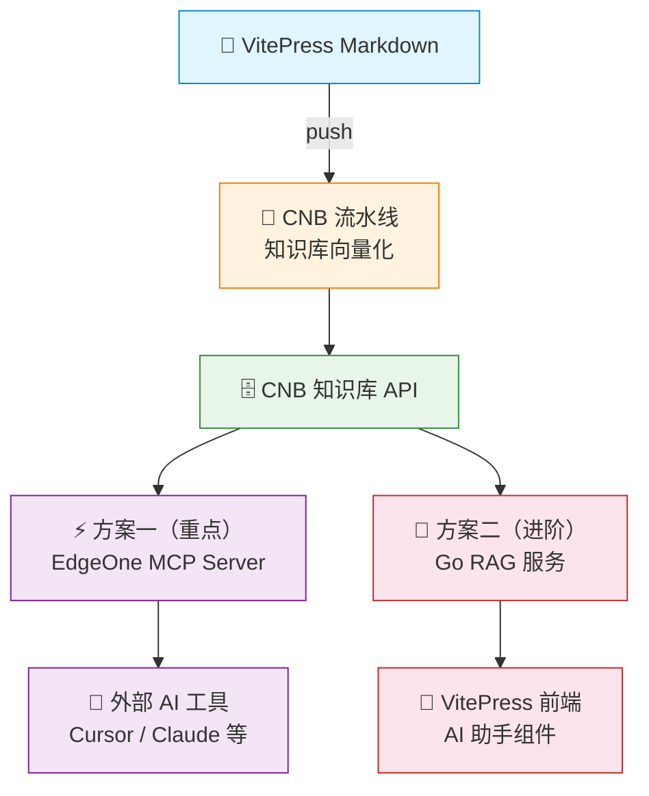

# 架构全景图

本项目核心是：**以 CNB 知识库为统一检索底座**，向上提供两种消费方式。

## 总体架构

## 数据流说明

1. 文档更新后推送到仓库
2. CNB 流水线自动将 Markdown 分块并向量化
3. 两套方案都通过 CNB 知识库 API 检索语义片段
4. 方案一由外部 AI 客户端完成对话与推理
5. 方案二由 Go 服务编排 LLM + Tool Calling

## 边界与职责

- **CNB**：文档向量化、知识库存储、查询 API
- **EdgeOne MCP Server**：对外暴露标准 MCP 工具协议
- **Go RAG 服务**：对话编排、模型调用、流式输出
- **前端组件**：交互体验、流式渲染、历史记录

## 设计原则

- 单一数据源：只维护一份文档知识库
- 协议标准化：优先使用 MCP，降低工具接入成本
- 渐进式建设：先方案一快速上线，再按需演进方案二
