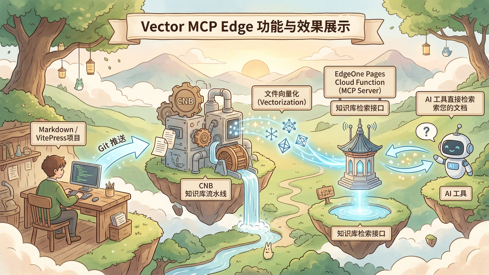

# Vector MCP Edge

欢迎来到 `vector-mcp-edge` 项目的功能与效果展示区。这里主要介绍本项目的架构设计以及两种不同的落地方案。

## 这个是什么?

其实项目是一个工作流，将 VitePress 或者任何 Markdown 文档项目部署在 [CNB](https://cnb.cool/)，并激活 CNB 的知识库流水线在 Git 推送时自动触发知识库构建，把相关文件向量化。

最后，我们使用 EdgeOne Pages 的 Cloud Function 作为 MCP Server，提供知识库检索接口，让 AI 工具可以直接检索你的文档。

如果你的 VitePress 文档也是部署在 EdgeOne Pages 上，那么相当于全 Serverless 方式，无需额外部署后端服务。当然，如果你想更智能一些，整合 MCP 为 Call Tool，也可以选择方案二。

- [方案对比与选型](./solutions.md)：一张表看懂两种方案的差异，快速选择最适合你的落地方式。

## 架构与方案

- [架构全景图](./architecture.md)：从全局视角理解项目的整体架构和数据流向。
- [方案一：接入外部 AI 工具](./solution-mcp.md)：**重点方案**，展示如何让 Cursor、Claude 等工具检索你的文档。
- [方案二：网页端 AI 助手](./solution-rag.md)：进阶方案，本站已内置 AI 聊天组件，但需手动部署 Go 后端后才能在网页端直接问答。
- [本站 MCP 端点](./mcp-endpoint.md)：本项目自身就内置了一个可用的 MCP Server，可直接接入 AI 工具。

## 下一步

了解完功能与效果后，你可以前往 [搭建教程](../guide/) 开始动手实践。
