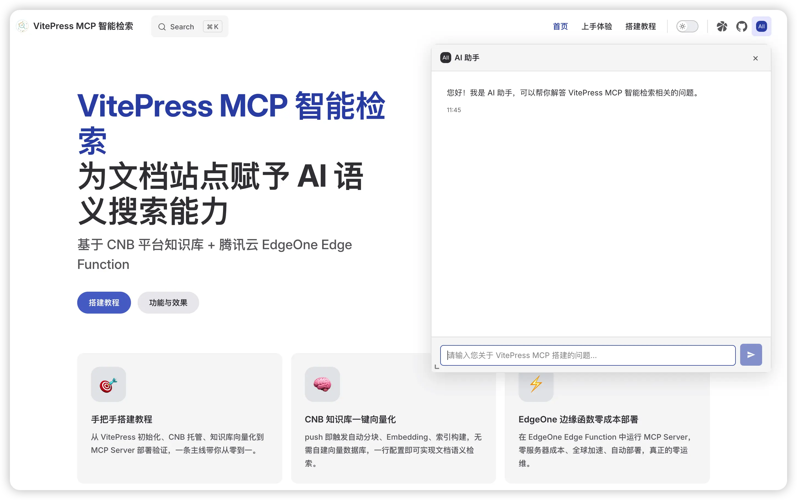

# Vector MCP Edge

欢迎来到 `vector-mcp-edge` 项目的功能与效果展示区。这里主要介绍本项目的架构设计以及应用场景。

## 这个是什么?

其实项目是一个工作流，将 VitePress 或者任何 Markdown 文档项目部署在 [CNB](https://cnb.cool/)，并激活 CNB 的知识库流水线在 Git 推送时自动触发知识库构建，把相关文件向量化。

基于 CNB 的知识库向量接口，本项目当前使用 **[Go Cloud Function](./solution-go-function)** 方案，将 MCP Server、RAG 问答、Tool Use 全部整合在 EdgeOne Pages 的 Go 边缘函数中，**无需自建服务器**，同时提供标准 MCP 端点和网页端 AI 助手。

::: details 📜 历史演进：为什么之前有三种场景？
由于 EdgeOne Pages 早期**仅支持 JS Cloud Function**，本项目最初将功能拆分为两种独立方案：

1. **[场景一：JS Serverless MCP](./solution-mcp)**（已归档）— 使用 JS Cloud Function 实现 MCP Server，仅提供外部 AI 工具检索能力，不支持网页端 AI 助手。
2. **[场景二：Go RAG 网页助手](./solution-rag)**（已归档）— 需要自建 Go 后端服务器，提供网页端 AI 问答，但无法提供 MCP 端点。

2026 年 4 月，EdgeOne Pages 新增了 Go Cloud Function 支持后，我们将两种方案**合并升级**为当前的 Go Cloud Function 方案，一个服务同时覆盖 MCP + RAG + Tool Use，不再需要分开部署。
:::

## 在线体验

本项目自身就是 Go Cloud Function 方案的真实落地产物——我们已经部署了一个可用的 MCP 端点和网页端 AI 助手，你可以立即接入体验：

- [本站 MCP 端点（Live Demo）](./mcp-endpoint) — 复制配置即可在 AI 编辑器中使用

Go Cloud Function 驱动的页面 AI 助手，你也可以在本站的右上角找到入口:

## 了解更多

- [方案详情：Go Cloud Function](./solution-go-function) — 当前推荐方案的完整介绍
- [方案演进与对比](./solutions) — 了解从历史方案到当前方案的演进过程
- [架构全景图](./architecture) — 从全局视角理解项目的整体架构和数据流向

## 下一步

了解完功能与效果后，你可以前往 [搭建教程](../guide/) 开始动手实践。
