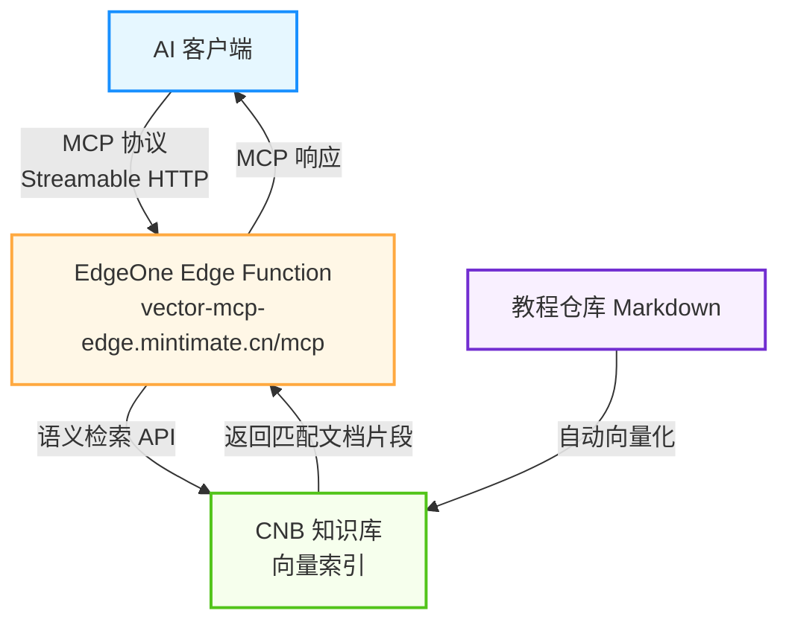

# 在线体验：本站 MCP 端点 <Badge type="tip" text="Live Demo" />

本项目不仅是一份教程，**它本身就是一个可运行的 Demo**。我们已经将本站的文档知识库通过 EdgeOne Pages Go Cloud Function 暴露为标准 MCP 端点，你可以立即接入体验。

> 💡 这就是 [Go Cloud Function 方案](./solution-go-function) 的真实落地效果。配置好后，你可以直接在 AI 编辑器中提问关于本教程的问题，AI 会自动查询知识库来回答。

## 端点信息

| 项目 | 说明 |
|------|------|
| **服务地址** | `https://vector-mcp-edge.mintimate.cn/mcp` |
| **传输协议** | Streamable HTTP |
| **协议版本** | `2025-03-26` |

## 可用工具一览

| 工具名 | 说明 |
|--------|------|
| `query_knowledge_base` | 语义搜索教程文档知识库 |
| `get_project_info` | 获取项目概览（技术栈、功能特性） |
| `get_quickstart` | 获取快速开始步骤指南 |
| `get_solutions` | 获取两种方案（MCP / Go RAG）的对比介绍 |

## 快速接入

复制以下配置到你的 AI 工具中，即可立即体验：

::: code-group

```json [Cursor (.cursor/mcp.json)]
{
  "mcpServers": {
    "vector-mcp-edge-docs": {
      "url": "https://vector-mcp-edge.mintimate.cn/mcp",
      "transport": "streamable-http"
    }
  }
}
```

```json [VS Code (.vscode/mcp.json)]
{
  "servers": {
    "vector-mcp-edge-docs": {
      "type": "http",
      "url": "https://vector-mcp-edge.mintimate.cn/mcp"
    }
  }
}
```

```json [Claude Desktop]
{
  "mcpServers": {
    "vector-mcp-edge-docs": {
      "url": "https://vector-mcp-edge.mintimate.cn/mcp",
      "transport": "streamable-http"
    }
  }
}
```

```json [Windsurf]
{
  "mcpServers": {
    "vector-mcp-edge-docs": {
      "serverUrl": "https://vector-mcp-edge.mintimate.cn/mcp",
      "transport": "streamable-http"
    }
  }
}
```

```json [Cherry Studio]
{
  "mcpServers": {
    "vector-mcp-edge-docs": {
      "isActive": true,
      "name": "VitePress MCP Docs",
      "type": "streamable-http",
      "description": "VitePress MCP 智能检索教程知识库",
      "baseUrl": "https://vector-mcp-edge.mintimate.cn/mcp"
    }
  }
}
```

:::

::: warning Cherry Studio 注意
Cherry Studio 的配置格式与其他客户端不同，请注意使用 `baseUrl` 而非 `url`，使用 `type` 而非 `transport`，并且 `name` 和 `type` 字段为必填项。
:::

## 试试问这些问题

配置完成后，在 AI 对话中直接提问即可，AI 会自动选择合适的工具来回答：

- *"如何将 VitePress 部署到 EdgeOne Pages？"* → 调用 `query_knowledge_base`
- *"CNB 知识库怎么配置向量化？"* → 调用 `query_knowledge_base`
- *"这个项目用了什么技术栈？"* → 调用 `get_project_info`
- *"快速开始需要几步？"* → 调用 `get_quickstart`
- *"方案一和方案二有什么区别？"* → 调用 `get_solutions`

## 工具参数说明

### `query_knowledge_base` — 教程文档语义搜索

| 参数 | 类型 | 必填 | 说明 |
|------|------|------|------|
| `query` | string | ✅ | 自然语言查询，支持中英文。例如：`如何配置 MCP Server` |
| `keyword` | string | ❌ | 关键词过滤，多个关键词用英文分号分隔。例如：`EdgeOne;MCP;部署` |
| `top_k` | number | ❌ | 返回结果的最大数量（默认 5，范围 1-10） |

### `get_project_info` / `get_quickstart` / `get_solutions`

无需参数，直接调用即可。

::: info 说明
MCP 工具的调用通常由 AI 助手自动完成，你只需要用自然语言提问即可，无需手动传递这些参数。
:::

## 用 curl 验证端点

```bash
# 查看服务信息（GET 请求）
curl https://vector-mcp-edge.mintimate.cn/mcp

# 初始化握手（POST 请求）
curl -X POST https://vector-mcp-edge.mintimate.cn/mcp \
  -H "Content-Type: application/json" \
  -d '{"jsonrpc":"2.0","id":1,"method":"initialize","params":{"protocolVersion":"2025-03-26","capabilities":{},"clientInfo":{"name":"test","version":"1.0"}}}'

# 调用工具 - 搜索文档
curl -X POST https://vector-mcp-edge.mintimate.cn/mcp \
  -H "Content-Type: application/json" \
  -d '{"jsonrpc":"2.0","id":3,"method":"tools/call","params":{"name":"query_knowledge_base","arguments":{"query":"如何部署到EdgeOne Pages"}}}'
```

## 技术实现

本 MCP 端点基于 [方案三（Go Cloud Function）](./solution-go-function) 部署。它使用 EdgeOne Pages 的 Go Cloud Function 能力，将 MCP Server、RAG 问答和 Tool Use 接口一体化运行在边缘函数上，通过 CNB 知识库的向量语义检索能力，将本站的 Markdown 文档自动向量化并建立索引。



> 想搭建自己的 MCP 端点？前往 [方案一详情](./solution-mcp) 了解完整方案，或直接查看 [搭建教程](/guide/) 开始动手。
