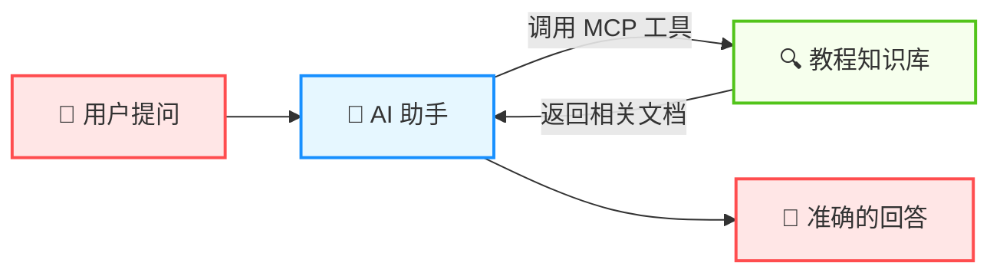
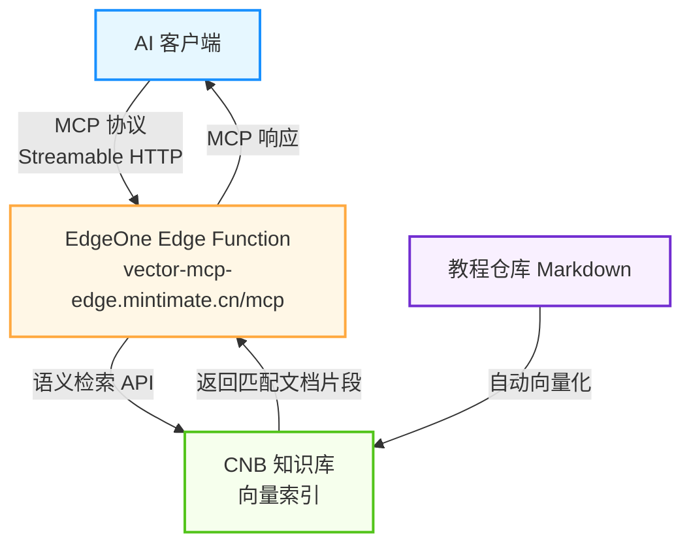

# 本站 MCP 端点 <Badge type="tip" text="Live" />

本项目不仅教你如何搭建 MCP Server，它**本身就内置了一个可用的 MCP 端点**。通过 MCP，你可以让 AI 编辑器（如 Cursor、Claude、VS Code 等）直接访问本站的文档知识库，获取 VitePress + MCP 搭建教程的准确信息。

> 简单来说：配置 MCP 后，你可以直接在 AI 编辑器中问关于本教程的问题，AI 会自动查询知识库来回答你。

## 什么是 MCP？

[MCP（Model Context Protocol，模型上下文协议）](https://modelcontextprotocol.io/) 是由 Anthropic 提出的一项开放协议，用于标准化 AI 模型与外部数据源和工具之间的交互方式。你可以把它理解为 AI 助手的"插件系统"——通过 MCP，AI 可以调用外部工具来获取实时的、准确的信息，而不是仅仅依赖训练数据。



## 服务信息

| 项目 | 说明 |
|------|------|
| **服务地址** | `https://vector-mcp-edge.mintimate.cn/mcp` |
| **传输协议** | Streamable HTTP |
| **协议版本** | `2025-03-26` |
| **可用工具** | `query_knowledge_base` — 语义搜索教程文档知识库 |
|  | `get_project_info` — 获取项目概览（技术栈、功能特性） |
|  | `get_quickstart` — 获取快速开始步骤指南 |
|  | `get_solutions` — 获取两种方案（MCP / Go RAG）的对比介绍 |

## 在 AI 编辑器中配置

### Cursor

在项目根目录创建 `.cursor/mcp.json` 文件，或者在 Cursor 的全局设置中添加：

```json
{
  "mcpServers": {
    "vector-mcp-edge-docs": {
      "url": "https://vector-mcp-edge.mintimate.cn/mcp",
      "transport": "streamable-http"
    }
  }
}
```

### Windsurf

在 Windsurf 的 MCP 配置文件中添加：

```json
{
  "mcpServers": {
    "vector-mcp-edge-docs": {
      "serverUrl": "https://vector-mcp-edge.mintimate.cn/mcp",
      "transport": "streamable-http"
    }
  }
}
```

### VS Code（GitHub Copilot / Cline）

在项目根目录创建 `.vscode/mcp.json` 文件：

```json
{
  "servers": {
    "vector-mcp-edge-docs": {
      "type": "http",
      "url": "https://vector-mcp-edge.mintimate.cn/mcp"
    }
  }
}
```

### Claude Desktop

在 Claude Desktop 的配置文件中添加（macOS 路径：`~/Library/Application Support/Claude/claude_desktop_config.json`，Windows 路径：`%APPDATA%\Claude\claude_desktop_config.json`）：

```json
{
  "mcpServers": {
    "vector-mcp-edge-docs": {
      "url": "https://vector-mcp-edge.mintimate.cn/mcp",
      "transport": "streamable-http"
    }
  }
}
```

### Cherry Studio

在 Cherry Studio 的设置中，进入 **MCP 服务器** 配置页面，添加一个新的 Streamable HTTP 类型的服务器：

```json
{
  "mcpServers": {
    "vector-mcp-edge-docs": {
      "isActive": true,
      "name": "VitePress MCP Docs",
      "type": "streamable-http",
      "description": "VitePress MCP 智能检索教程知识库",
      "baseUrl": "https://vector-mcp-edge.mintimate.cn/mcp"
    }
  }
}
```

::: warning 注意
Cherry Studio 的配置格式与其他客户端不同，请注意使用 `baseUrl` 而非 `url`，使用 `type` 而非 `transport`，并且 `name` 和 `type` 字段为必填项。
:::

::: tip 提示
不同的 AI 编辑器/客户端配置格式可能略有差异，请参考对应工具的官方文档。以上配置仅供参考，核心是将 MCP 服务地址 `https://vector-mcp-edge.mintimate.cn/mcp` 配置到对应的 MCP 设置中。
:::

## 使用方法

配置完成后，你可以在 AI 对话中直接提问关于本项目教程的问题，AI 会自动选择合适的工具来回答。例如：

- *"如何将 VitePress 部署到 EdgeOne Pages？"* → 调用 `query_knowledge_base`
- *"CNB 知识库怎么配置向量化？"* → 调用 `query_knowledge_base`
- *"这个项目用了什么技术栈？"* → 调用 `get_project_info`
- *"快速开始需要几步？"* → 调用 `get_quickstart`
- *"方案一和方案二有什么区别？"* → 调用 `get_solutions`

### 工具参数

#### `query_knowledge_base` — 教程文档语义搜索

| 参数 | 类型 | 必填 | 说明 |
|------|------|------|------|
| `query` | string | ✅ | 自然语言查询，支持中英文。例如：`如何配置 MCP Server` |
| `keyword` | string | ❌ | 关键词过滤，多个关键词用英文分号分隔。例如：`EdgeOne;MCP;部署` |
| `top_k` | number | ❌ | 返回结果的最大数量（默认 5，范围 1-10） |

#### `get_project_info` — 获取项目概览

无需参数，返回项目名称、技术栈、核心功能、仓库链接等信息。

#### `get_quickstart` — 获取快速开始指南

无需参数，返回从初始化到部署验证的 5 步快速开始教程，附带详细文档链接。

#### `get_solutions` — 获取方案对比

无需参数，返回方案一（MCP 外部 AI 工具接入）和方案二（Go RAG 网页端问答）的详细对比。

::: info 说明
MCP 工具的调用通常由 AI 助手自动完成，你只需要用自然语言提问即可，无需手动传递这些参数。
:::

## 技术实现

本 MCP 服务基于 [EdgeOne Pages Cloud Functions](https://edgeone.ai/) 部署，使用了 CNB 知识库的向量语义检索能力。文档仓库的 Markdown 内容会自动向量化并建立索引，从而支持高精度的语义搜索。

整体架构如下：



::: tip 验证端点
你可以用 `curl` 快速验证 MCP 端点是否正常工作：

```bash
# 查看服务信息（GET 请求）
curl https://vector-mcp-edge.mintimate.cn/mcp

# 初始化握手（POST 请求）
curl -X POST https://vector-mcp-edge.mintimate.cn/mcp \
  -H "Content-Type: application/json" \
  -d '{"jsonrpc":"2.0","id":1,"method":"initialize","params":{"protocolVersion":"2025-03-26","capabilities":{},"clientInfo":{"name":"test","version":"1.0"}}}'

# 调用工具 - 搜索文档
curl -X POST https://vector-mcp-edge.mintimate.cn/mcp \
  -H "Content-Type: application/json" \
  -d '{"jsonrpc":"2.0","id":3,"method":"tools/call","params":{"name":"query_knowledge_base","arguments":{"query":"如何部署到EdgeOne Pages"}}}'
```
:::
