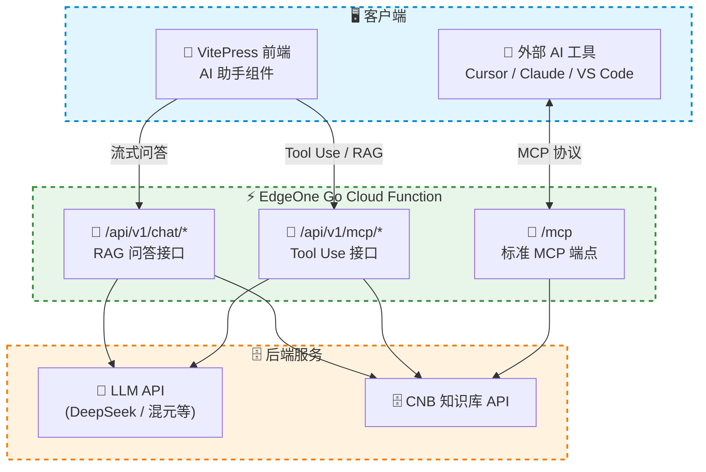

# Go Cloud Function — 一体化 AI 助手

> ✅ **当前推荐方案**。EdgeOne Pages 已支持 Go Cloud Function，本项目基于此实现了一体化的 Go 后端，将 MCP Server、RAG 问答、Tool Use 全部整合在边缘函数中，**无需自建服务器**。

## 演进背景

EdgeOne Pages 早期仅支持 JS Cloud Function，因此本项目最初将功能拆分为两种独立方案：

- **场景一（JS Serverless MCP）**：用 JS 边缘函数实现 MCP Server，仅提供外部 AI 工具检索
- **场景二（Go RAG 自建服务）**：需要自建 Go 服务器，提供网页端 AI 问答

2026 年 4 月，EdgeOne Pages 新增 Go Cloud Function 支持后，我们将两种方案**合并升级**为当前的 Go Cloud Function 方案——一个服务同时覆盖 MCP + RAG + Tool Use，不再需要分开部署。



## 工作原理

1. **文档向量化**：与场景一、二共享同一套 CNB 知识库流水线，Markdown 文档自动向量化
2. **Go Cloud Function**：EdgeOne Pages 部署时自动识别 `cloud-functions/` 下的 Go 代码，编译并运行在边缘节点
3. **MCP 端点**：`/mcp` 路由实现标准 MCP Streamable HTTP 协议，供外部 AI 工具接入
4. **RAG 问答**：`/api/v1/chat` 和 `/api/v1/chat/stream` 提供非流式和流式 RAG 问答
5. **Tool Use**：`/api/v1/mcp/tools`、`/api/v1/mcp/tools/call`、`/api/v1/mcp/llm/chat` 支持前端 AI 组件的 Function Calling 流程

> 💡 与历史场景二的核心区别：**无需自建服务器**。Go 后端直接运行在 EdgeOne 边缘函数上，享受全球 CDN 加速和自动扩缩容。

## 路由总览

| 路由 | 方法 | 说明 |
|------|------|------|
| `/` | GET | 服务信息 |
| `/api/v1/health` | GET | 健康检查 |
| `/api/v1/chat` | POST | RAG 非流式问答 |
| `/api/v1/chat/stream` | POST | RAG 流式问答（SSE） |
| `/api/v1/mcp/tools` | GET | Tool Use 工具列表 |
| `/api/v1/mcp/tools/call` | POST | Tool Use 工具调用 |
| `/api/v1/mcp/llm/chat` | POST | Tool Use LLM 聊天（支持 Function Calling） |
| `/mcp` | ANY | 标准 MCP Streamable HTTP 端点 |

## 技术栈

| 组件 | 说明 |
|------|------|
| **Go 1.22+** | 主要开发语言 |
| **Gin** | HTTP 框架，路由与中间件 |
| **go-openai** | OpenAI 兼容 API 客户端（支持 DeepSeek、混元等） |
| **EdgeOne Pages** | Go Cloud Function 运行环境 |
| **CNB 知识库** | 向量化存储与语义检索 |

## 项目结构

```
cloud-functions/
├── go.mod                          # Go 模块定义
├── index.go                        # 入口文件（路由编排）
└── internal/
    ├── config/
    │   └── config.go               # 配置加载、CORS 中间件、AI 客户端
    ├── handler/
    │   ├── mcp.go                  # 标准 MCP Streamable HTTP 端点
    │   ├── rag.go                  # RAG 问答（流式 / 非流式）
    │   └── tooluse.go              # Tool Use 接口（前端 AI 组件）
    └── knowledge/
        └── knowledge.go            # CNB 知识库查询与结果格式化
```

## 环境变量

Go Cloud Function 通过环境变量获取配置，EdgeOne Pages 部署时会自动注入 `CNB_TOKEN`：

| 变量名 | 必填 | 说明 |
|--------|------|------|
| `KNOWLEDGE_API_URL` | 是 | CNB 知识库查询 API 地址 |
| `CNB_TOKEN` | 是 | CNB 访问令牌（EdgeOne Pages 自动注入） |
| `AI_BASE_URL` | 是 | OpenAI 兼容 API 地址（如 DeepSeek、混元） |
| `AI_API_KEY` | 是 | AI API 密钥 |
| `AI_MODEL` | 是 | 模型名称（如 `deepseek-r1`、`hunyuan-t1-20250711`） |
| `RAG_SYSTEM_PROMPT` | 否 | 自定义系统提示词，默认使用内置提示词 |

## 与历史方案的对比

| | 场景一：JS MCP（已归档） | 场景二：Go RAG 自建（已归档） | Go Cloud Function（当前） |
|------|----------------|---------------------|---------------------------|
| **运行环境** | EdgeOne JS Function | 自建服务器 | EdgeOne Go Function |
| **MCP 端点** | ✅ | ❌ | ✅ |
| **网页 AI 助手** | ❌ | ✅ | ✅ |
| **RAG 问答** | ❌ | ✅ | ✅ |
| **Tool Use** | ❌ | ✅ | ✅ |
| **自建服务器** | 不需要 | 需要 | 不需要 |
| **LLM 调用** | 外部工具自带 | Go 后端调用 | Go Function 调用 |
| **运维复杂度** | 低 | 中~高 | 低 |
| **全球加速** | ✅ CDN | 取决于部署位置 | ✅ CDN |

## 场景优势

| 优势 | 说明 |
|------|------|
| **一体化** | MCP + RAG + Tool Use 全部在一个 Go 服务中，统一维护 |
| **零服务器** | 运行在 EdgeOne 边缘函数，无需自建服务器 |
| **全球加速** | EdgeOne CDN 天然低延迟 |
| **Go 生态** | 使用 Go 语言，性能优异，生态丰富 |
| **自动鉴权** | `CNB_TOKEN` 自动注入，无需手动管理密钥 |
| **流式支持** | 支持 SSE 流式输出，DeepSeek-R1 风格思考链展示 |
| **兼容前端** | 完全兼容本项目已有的 Vue AI 助手组件 |

## 适用场景

### 选 Go Cloud Function，如果你：

- 希望**同时**拥有 MCP 端点和网页端 AI 助手
- 不想自建和维护服务器
- 熟悉 Go 语言，希望用 Go 编写后端逻辑
- 需要更灵活的后端能力（如自定义 RAG 编排、多工具路由）

::: details 历史方案参考
如果你有特殊需求（如私有化部署、特定网络环境），仍可参考历史方案的实现思路：
- [场景一：JS Serverless MCP](./solution-mcp)（已归档）
- [场景二：Go RAG 自建服务](./solution-rag)（已归档）
:::

## 下一步

- 📖 [前往搭建教程：Go Cloud Function](/guide/cloud-function) — 从零开始搭建
- 🎯 [体验本站 Demo](./mcp-endpoint) — 本站已使用 Go Cloud Function 部署
- 📜 [查看历史方案](./solutions) — 了解从分开部署到一体化的演进过程
