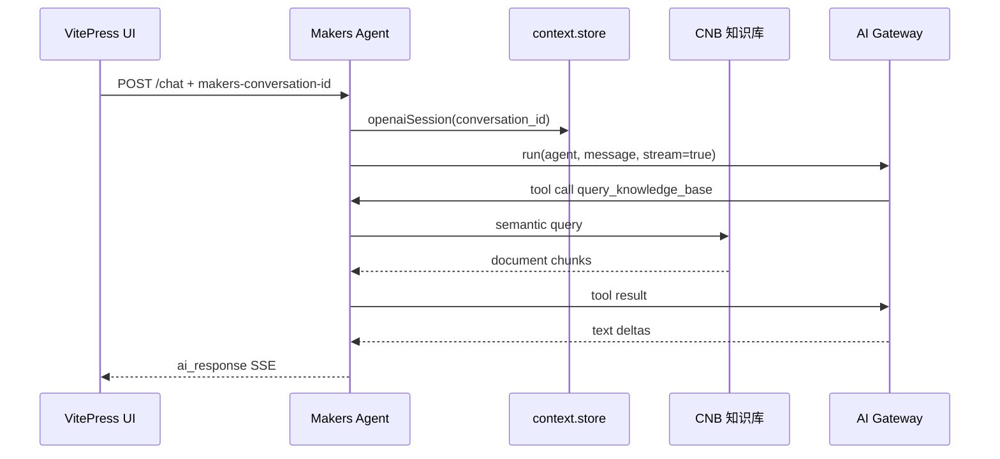

# EdgeOne Makers：MCP + 托管 Agent

> 当前推荐方案。EdgeOne Pages 已更名为 **EdgeOne Makers**，并支持直接托管 Agent。本项目因此从“Go Function 包办全部 AI 流程”升级为“Cloud Function 提供 MCP，Agent 提供网页问答”。

## 方案组成

| 组件 | 职责 |
|------|------|
| VitePress | 文档站点与网页聊天 UI |
| Node Cloud Function | `/mcp` 标准 Streamable HTTP 端点，不拦截静态站点 |
| Makers Agent | `/chat` 多轮问答与 `/stop` 中止端点 |
| Makers AI Gateway | 托管模型访问，使用 `AI_GATEWAY_*` 配置 |
| Makers Store | 通过 `openaiSession(conversation_id)` 持久化会话 |
| CNB 知识库 | 文档向量化与 `query_knowledge_base` 语义检索 |

## 路由

| 路由 | 运行时 | 说明 |
|------|--------|------|
| `/chat` | Makers Agent | SSE 多轮知识库问答，请求头必须带 `makers-conversation-id` |
| `/stop` | Makers Agent | 中止运行；body 与当前 runtime 要求的请求头使用同一个 conversation ID |
| `/mcp` | Node Cloud Function | 面向 Cursor、Claude、VS Code 等客户端的 MCP 端点 |
| `/api/v1/health` | Node Cloud Function | MCP 服务健康检查 |

## Agent 运行流程



Agent 流每 5 秒发送 `ping`，结束时发送 `[DONE]`。模型调用和工具循环设置了最大轮数，并透传 `context.request.signal`。

## 环境变量

提交到仓库的 `.env.example` 声明：

```env
AI_GATEWAY_API_KEY=
AI_GATEWAY_BASE_URL=
AI_GATEWAY_MODEL=

CNB_KNOWLEDGE_BASE_URL=
CNB_KNOWLEDGE_BASE_TOKEN=
```

`AI_GATEWAY_API_KEY` 与 `AI_GATEWAY_BASE_URL` 由 Makers 部署流程自动配置；CNB URL 和 Token 属于业务变量，需要通过 `edgeone makers env set` 设置。

## 相比旧方案

| 维度 | 旧 Go Function 一体化 | Makers 托管 Agent |
|------|------------------------|-------------------|
| 模型访问 | 自行配置 OpenAI 兼容 API | Makers AI Gateway |
| 会话历史 | 浏览器手工拼接最近消息 | `context.store.openaiSession()` |
| Tool Calling | 浏览器两轮编排 | Agent SDK Runner 托管 |
| 流式协议 | 自定义多套 SSE | 统一 Makers SSE 事件 |
| 中止运行 | 仅断开前端请求 | `/stop` + `abortActiveRun` |
| MCP | 与推理揉在同一服务 | 独立路径级 Node Function，不影响静态路由 |

## 下一步

- [搭建 Makers 与托管 Agent](/guide/cloud-function)
- [配置网页端 AI 助手](/guide/ai-assistant)
- [查看架构全景图](/features/architecture)
