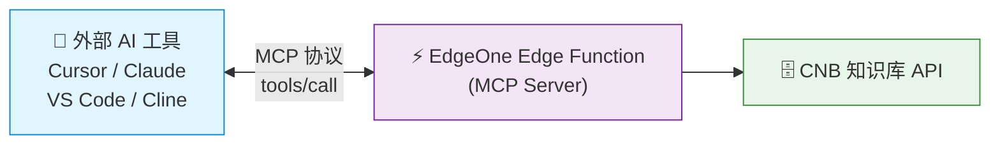

# 方案一：接入外部 AI 工具（重点）

> 这是本教程的**核心方案**。通过 EdgeOne Pages 部署的 MCP Server，让外部 AI 工具可以直接检索你的文档知识库。

## 架构



## 添加到 Cursor / VS Code

在项目根目录创建 `.cursor/mcp.json` 或 `.vscode/mcp.json`：

```json
{
  "servers": {
    "my-docs": {
      "url": "https://<你的域名>/mcp",
      "type": "streamable-http"
    }
  }
}
```

::: tip 真实示例
本项目自身就提供了一个可用的 MCP 端点，你可以直接复制以下配置来验证效果。详见 [本站 MCP 端点](./mcp-endpoint)。

```json
{
  "servers": {
    "vector-mcp-edge-docs": {
      "url": "https://vector-mcp-edge.mintimate.cn/mcp",
      "type": "streamable-http"
    }
  }
}
```
:::

## 添加到 Claude Desktop

编辑配置文件 `~/Library/Application Support/Claude/claude_desktop_config.json`：

```json
{
  "mcpServers": {
    "my-docs": {
      "url": "https://<你的域名>/mcp",
      "type": "streamable-http"
    }
  }
}
```

## 添加到 Cline / Cherry Studio 等

大多数支持 MCP 的客户端都可以通过填入 MCP Server URL 来接入：

```
https://<你的域名>/mcp
```

## 方案优势

| 优势 | 说明 |
|------|------|
| **零服务器成本** | 完全运行在 EdgeOne 边缘函数上 |
| **标准协议** | 遵循 MCP 协议，任何支持 MCP 的客户端都可接入 |
| **自动鉴权** | `CNB_TOKEN` 自动注入，无需手动管理密钥 |
| **全球加速** | EdgeOne CDN 天然低延迟 |
