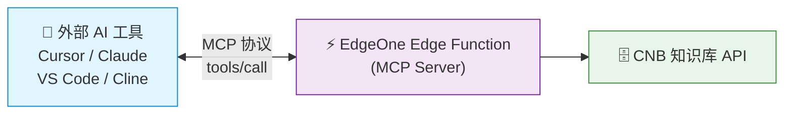

# 场景一：Serverless MCP — 接入外部 AI 工具

> 这是本教程的**核心场景**。通过 EdgeOne Pages 的 Cloud Function 部署 MCP Server，让 Cursor、Claude、VS Code 等外部 AI 工具直接检索你的文档知识库，**全程无需自建服务器**。

## 场景定位

本方案利用 CNB 的知识库向量化流水线 + EdgeOne Pages Cloud Function，以 Serverless 方式对外暴露标准 MCP 协议端点。外部 AI 工具通过 MCP 协议调用你的知识库，完成语义检索。



## 工作原理

1. **文档向量化**：通过 CNB 流水线，Git 推送时自动将 Markdown 文档分块并向量化，存入 CNB 知识库
2. **MCP Server**：EdgeOne Pages Cloud Function 作为 MCP Server，封装 CNB 知识库查询接口
3. **AI 工具调用**：外部 AI 工具（Cursor、Claude 等）通过 MCP 协议调用 Server，获取语义检索结果
4. **LLM 推理**：AI 工具自带的 LLM 基于检索结果生成回答

> 💡 整个链路中，LLM 推理由外部 AI 工具自身完成，你只需要提供知识库检索能力。

## 如何配置 AI 工具

部署完成后，你会得到一个 MCP 端点地址（如 `https://<你的域名>/mcp`），将其配置到 AI 工具中即可。

### Cursor / VS Code

在项目根目录创建 `.cursor/mcp.json` 或 `.vscode/mcp.json`：

```json
{
  "servers": {
    "my-docs": {
      "url": "https://<你的域名>/mcp",
      "type": "streamable-http"
    }
  }
}
```

### Claude Desktop

编辑配置文件（macOS：`~/Library/Application Support/Claude/claude_desktop_config.json`，Windows：`%APPDATA%\Claude\claude_desktop_config.json`）：

```json
{
  "mcpServers": {
    "my-docs": {
      "url": "https://<你的域名>/mcp",
      "type": "streamable-http"
    }
  }
}
```

### 其他 MCP 客户端（Cline / Cherry Studio 等）

大多数支持 MCP 的客户端都可以通过填入 MCP Server URL 来接入：

```
https://<你的域名>/mcp
```

::: tip 想立即体验？
本项目自身就提供了一个可用的 MCP 端点，无需自己部署即可验证效果。前往 [本站 MCP 端点（Live Demo）](./mcp-endpoint) 获取配置。
:::

## 场景优势

| 优势 | 说明 |
|------|------|
| **零服务器成本** | 完全运行在 EdgeOne 边缘函数上，无需自建服务器 |
| **标准协议** | 遵循 MCP 协议，任何支持 MCP 的客户端都可接入 |
| **自动鉴权** | `CNB_TOKEN` 自动注入，无需手动管理密钥 |
| **全球加速** | EdgeOne CDN 天然低延迟 |
| **极简部署** | 只需三个文件：`.cnb.yml` + `edgeone.json` + `cloud-functions/mcp/index.js` |

## 与场景二的区别

| | 场景一：Serverless MCP | 场景二：Go RAG + 前端 AI 助手 |
|------|------------------------|-------------------------------|
| **使用者** | 开发者（Cursor、Claude 等 AI 工具） | 网站访客（浏览器内直接问答） |
| **LLM 调用** | 由外部 AI 工具自带 | Go 后端调用（如 DeepSeek） |
| **服务器** | 无（EdgeOne 边缘函数） | 需自建或云服务器 |
| **上线速度** | ⚡ 快（推荐首选） | 中等（需要联调） |

> 两种场景可以共存，共享同一份 CNB 知识库数据源。详见 [方案对比与选型](./solutions)。

## 下一步

- 🚀 [立即体验本站 Demo](./mcp-endpoint) — 零配置验证效果
- 📖 [前往搭建教程](/guide/) — 从零开始搭建你自己的 MCP Server
- 🔍 [了解场景二](./solution-rag) — 如果你还需要网页端 AI 问答
