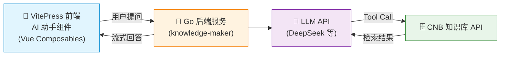

# 方案二：自建 Go 服务实现 RAG（进阶）

> 如果你希望在 VitePress 网页端直接提供 AI 问答体验（而不仅仅是给外部工具用），可以考虑这套进阶方案。

## 架构



## 与方案一的区别

- **方案一**：MCP Server 给**外部 AI 工具**用，LLM 由外部工具自带
- **方案二**：Go 后端**自己调用 LLM**，自动执行 Tool Calling 检索知识库，前端只负责展示

## Go 后端服务

使用开源项目 [Knowledge Maker](https://github.com/Mintimate/knowledge-maker)，通过配置文件快速接入：

```yaml
# AI 服务配置
ai:
  base_url: "https://api.deepseek.com/v1"
  api_key: "your_api_key_here"
  model: "deepseek-chat"

# 知识库配置（对接 CNB 知识库 API）
knowledge:
  base_url: "https://api.cnb.cool/<用户名>/<仓库组>/<仓库名>/-/knowledge/base/query"
  token: "your_cnb_token_here"
```

部署后提供流式 API：
- `/api/v1/chat/stream`：流式返回大模型回答，支持返回 Tool Calls 与结果

## 前端 AI 助手组件

参考 [Oh My Rime](https://cnb.cool/Mintimate/rime/DocVitePressOMR) 的前端实现，采用模块化 Vue Composables 架构：

```
aiChat/
├── index.vue              # 入口组件
├── aiChat.styles.css       # 样式
└── composables/
    ├── useChat.js          # 聊天核心：消息管理、历史记录
    ├── useToolCall.js      # MCP 工具调用：LLM 流式请求、Tool Use 流程
    ├── useMarkdown.js      # Markdown 渲染
    └── useCaptcha.js       # 验证码管理
```

### 流式请求与 Tool Use

前端通过 SSE 流式读取大模型回复：

```javascript
const reader = response.body.getReader()
let toolCallsMap = {} // {index: {id, name, arguments}}

while (!(result = await reader.read()).done) {
  // delta.reasoning_content → 思考面板
  // delta.content → 渲染正文
  // delta.tool_calls → 聚合工具调用增量
}

// 如果 LLM 返回 tool_calls：
// → 自动调用 MCP 工具 → 将结果回传 LLM → 第二轮生成
```

## 方案优势

| 优势 | 说明 |
|------|------|
| **网页端体验** | 终端用户无需安装 AI 工具，直接在网页上问答 |
| **完整 RAG** | Go 后端编排 LLM + 知识库，支持 Tool Calling |
| **思考链展示** | 支持展示大模型的推理过程 |
| **开源可控** | Go 后端和前端组件均开源 |
