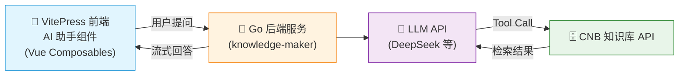

# 场景二：Go RAG 网页助手（已归档）

> ⚠️ **本方案已归档**。EdgeOne Pages 现已支持 Go Cloud Function，本方案的功能已被 [Go Cloud Function 方案](./solution-go-function) 完全替代（无需自建服务器）。保留本页仅供历史参考。
>
> 👉 推荐前往 [Go Cloud Function 方案](./solution-go-function) 查看当前方案。

---

> 以下为历史内容，介绍早期 EdgeOne Pages 仅支持 JS 时，需要自建 Go 服务器的实现方式。

通过自建 Go 后端服务，将 AI 问答能力直接嵌入 VitePress 网页，让网站访客无需安装任何工具即可体验 AI 问答。

## 场景定位

本方案同样基于 CNB 知识库的向量化能力，但不同于场景一的 Serverless 方式，这里需要你**手动部署一个 Go 后端服务**来编排 LLM 调用和知识库检索。前端 AI 助手组件已内置在本项目中，部署后端后即可启用。



## 工作原理

1. **文档向量化**：与场景一共享同一套 CNB 知识库流水线，Markdown 文档自动向量化
2. **Go 后端编排**：Go 服务接收用户提问，调用 LLM 并通过 Tool Calling 检索知识库
3. **流式输出**：LLM 的回答通过 SSE 流式返回给前端
4. **前端渲染**：VitePress 内置的 AI 助手组件实时渲染回答，支持思考链展示

> 💡 与场景一的核心区别：这里的 LLM 推理由你自己的 Go 后端完成，而非依赖外部 AI 工具。

## 本站效果

本项目导航栏右侧已集成 AI 助手按钮，点击即可在页面内进行对话。AI 会自动调用知识库工具，基于文档内容回答问题。

## 前端组件

本项目已实现完整的 AI 助手聊天组件，位于 `.vitepress/theme/components/aiChat/`：

```
aiChat/
├── index.vue                    # 入口组件（导航栏悬浮按钮 + 聊天窗口）
├── aiChat.styles.css             # 样式（响应式 + 深色模式 + 拖拽调整）
└── composables/
    ├── useChat.js                # 聊天核心：消息管理、历史记录、滚动控制
    ├── useToolCall.js            # MCP 工具调用：LLM 流式请求、Tool Use 两轮流程
    └── useMarkdown.js            # Markdown 渲染（markdown-it）
```

### 组件特性

- **流式输出**：SSE 实时渲染 AI 回答
- **思考链展示**：可折叠展示大模型推理过程
- **工具调用可视化**：三步进度指示（分析问题 → 查询知识库 → 生成回答）
- **窗口可拖拽**：支持自定义聊天窗口大小
- **响应式设计**：适配桌面端和移动端
- **无验证码**：简化版，无需额外鉴权配置

## Go 后端服务

后端代码与镜像：

- 代码仓库（CNB）：[knowledge-maker](https://cnb.cool/Mintimate/tool-forge/knowledge-maker)
- 容器镜像：`docker.cnb.cool/mintimate/tool-forge/knowledge-maker`

部署后提供以下 API：

| 端点 | 方法 | 说明 |
|------|------|------|
| `/api/v1/mcp/tools` | GET | 获取 MCP 工具列表 |
| `/api/v1/mcp/tools/call` | POST | 调用指定 MCP 工具 |
| `/api/v1/mcp/llm/chat` | POST (SSE) | LLM 流式对话，支持 Tool Calling |

### 方式一：使用 Docker Compose（推荐）

在服务器新建 `docker-compose.yml`：

```yaml
services:
  vector-mcp-edge:
    image: docker.cnb.cool/mintimate/tool-forge/knowledge-maker
    container_name: vector-mcp-edge
    volumes:
      - ./logs:/app/logs
    ports:
      - "8100:8082"
    environment:
      - PORT=8082
      - GIN_MODE=debug
      - AI_BASE_URL=https://api.cnb.cool/<你的组织>/<你的项目>/-/ai
      - AI_API_KEY=<你的AI_KEY>
      - AI_MODEL=hunyuan-t1-20250711
      - KNOWLEDGE_BASE_URL=https://api.cnb.cool/<用户名>/<仓库组>/<仓库名>/-/knowledge/base/query
      - KNOWLEDGE_TOKEN=<你的CNB_TOKEN>
      - KNOWLEDGE_TOP_K=3
      - RAG_SYSTEM_PROMPT=|
        你是 AI 助手，专门检索 AI、MCP 和 CNB、云原生构建有关问题，拒绝其他内容。
        请严格基于知识库内容回答，并使用用户提问的语言。
    restart: unless-stopped
```

启动与查看状态：

```bash
docker compose up -d
docker compose ps
docker compose logs -f vector-mcp-edge
```

### 方式二：手动构建运行（可选）

如果你希望自行改造代码，可直接拉取后端仓库手动运行：

```bash
git clone https://cnb.cool/Mintimate/tool-forge/knowledge-maker.git
cd knowledge-maker
# 按仓库说明配置环境变量或配置文件后启动
```

### 后端环境变量说明

| 变量名 | 必填 | 说明 |
|------|------|------|
| `PORT` | 否 | 服务监听端口，默认 `8082` |
| `GIN_MODE` | 否 | `debug` 或 `release` |
| `AI_BASE_URL` | 是 | 模型网关地址 |
| `AI_API_KEY` | 是 | 模型调用密钥 |
| `AI_MODEL` | 是 | 模型名称 |
| `KNOWLEDGE_BASE_URL` | 是 | CNB 知识库查询接口 |
| `KNOWLEDGE_TOKEN` | 是 | CNB 访问令牌 |
| `KNOWLEDGE_TOP_K` | 否 | 召回条数，默认可设 `3` |
| `RAG_SYSTEM_PROMPT` | 否 | 系统提示词，可多行 |

### 后端验收（上线前建议）

将 `<你的后端域名>` 替换成实际地址，执行以下检查：

```bash
curl -sS https://<你的后端域名>/api/v1/mcp/tools
curl -sS -X POST https://<你的后端域名>/api/v1/mcp/tools/call \
  -H "Content-Type: application/json" \
  -d '{"name":"search_docs","arguments":{"query":"MCP 是什么"}}'
```

## 前端环境变量配置

前端组件通过环境变量连接 Go 后端。在 `vite.config.mjs` 中已配置自动注入所有 `AI_` 前缀变量。

### 开发环境

```bash
export AI_MCP_BASE_URL=http://localhost:8082/api/v1/mcp
yarn dev
```

### 生产环境

在部署平台（如 CNB 流水线）中配置环境变量：

| 变量名 | 说明 | 示例 |
|--------|------|------|
| `AI_MCP_BASE_URL` | Go 后端 MCP 接口地址 | `https://your-domain.com/api/v1/mcp` |
| `AI_MAX_HISTORY_TURNS` | 最大历史轮数（默认 3） | `5` |
| `AI_WELCOME_MESSAGE` | 欢迎消息 | `您好！我是 AI 助手。` |
| `AI_DEFAULT_TOOLS` | 降级工具定义 JSON | `[]` |

::: tip
`AI_MCP_BASE_URL` 必须包含 `/api/v1/mcp` 路径前缀，因为前端代码会在此基础上拼接 `/tools`、`/tools/call`、`/llm/chat`。
:::

## 部署步骤

1. **先部署 Go 后端**：优先用上面的 Docker Compose 启动 `knowledge-maker` 服务
2. **验收后端接口**：确认 `/api/v1/mcp/tools` 和 `/api/v1/mcp/tools/call` 可访问
3. **配置前端环境变量**：将 `AI_MCP_BASE_URL` 设置为 `https://<你的后端域名>/api/v1/mcp`
4. **重新构建部署站点**：`git push` 后 VitePress 自动构建，网页端 AI 助手即可连通

## 与场景一的区别

> 注：以下对比为历史参考。当前推荐直接使用 [Go Cloud Function 方案](./solution-go-function)，已合并了两种场景的所有能力。

| | 场景一：Serverless MCP | 场景二：Go RAG + 前端 AI 助手 |
|------|------------------------|-------------------------------|
| **使用者** | 开发者（Cursor、Claude 等） | 网站访客（浏览器内） |
| **LLM 调用** | 由外部 AI 工具自带 | Go 后端自动调用 |
| **前端改动** | 无需改动 | 已内置 Vue 组件 |
| **额外部署** | 无 | 需部署 Go 后端 |

> 两种场景可以共存，共享同一份 CNB 知识库数据源。详见 [方案对比与选型](./solutions)。

## 场景优势

| 优势 | 说明 |
|------|------|
| **零门槛体验** | 网站访客无需安装任何 AI 工具，直接在网页问答 |
| **完整 RAG** | Go 后端编排 LLM + 知识库，支持 Tool Calling |
| **思考链展示** | 支持展示大模型的推理过程，增强可信度 |
| **实时流式** | SSE 流式输出，打字机效果展示回答 |
| **已内置组件** | 本项目前端组件已就绪，只需部署 Go 后端即可启用 |

## 下一步

- ⭐ [前往 Go Cloud Function 方案](./solution-go-function) — 当前推荐方案，无需自建服务器
- 🚀 [立即体验本站 Demo](./mcp-endpoint) — 已使用 Go Cloud Function 部署
- 📖 [前往搭建教程](/guide/) — 从零开始搭建
