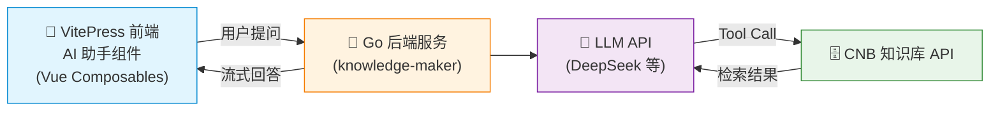

# 方案二：网页端 AI 助手（进阶）

> 本项目已内置 AI 助手聊天组件，部署 Go 后端后即可在网页端直接提供 AI 问答体验。

## 本站效果

本项目导航栏右侧已集成 AI 助手按钮，点击即可在页面内进行对话。AI 会自动调用知识库工具，基于文档内容回答问题。

## 架构



## 与方案一的区别

| | 方案一：MCP Server | 方案二：AI 助手组件 |
|------|-------------------|---------------------|
| **使用者** | 开发者（Cursor、Claude 等） | 网站访客（浏览器内） |
| **LLM 调用** | 由外部 AI 工具自带 | Go 后端自动调用 |
| **前端改动** | 无需改动 | 已内置 Vue 组件 |
| **额外部署** | 无 | 需部署 Go 后端 |

## 前端组件

本项目已实现完整的 AI 助手聊天组件，位于 `.vitepress/theme/components/aiChat/`：

```
aiChat/
├── index.vue                    # 入口组件（导航栏悬浮按钮 + 聊天窗口）
├── aiChat.styles.css             # 样式（响应式 + 深色模式 + 拖拽调整）
└── composables/
    ├── useChat.js                # 聊天核心：消息管理、历史记录、滚动控制
    ├── useToolCall.js            # MCP 工具调用：LLM 流式请求、Tool Use 两轮流程
    └── useMarkdown.js            # Markdown 渲染（markdown-it）
```

### 组件特性

- **流式输出**：SSE 实时渲染 AI 回答
- **思考链展示**：可折叠展示大模型推理过程
- **工具调用可视化**：三步进度指示（分析问题 → 查询知识库 → 生成回答）
- **窗口可拖拽**：支持自定义聊天窗口大小
- **响应式设计**：适配桌面端和移动端
- **无验证码**：简化版，无需额外鉴权配置

## Go 后端服务

使用开源项目 [Knowledge Maker](https://github.com/Mintimate/knowledge-maker)，通过配置文件接入：

```yaml
# AI 服务配置
ai:
  base_url: "https://api.deepseek.com/v1"
  api_key: "your_api_key_here"
  model: "deepseek-chat"

# 知识库配置（对接 CNB 知识库 API）
knowledge:
  base_url: "https://api.cnb.cool/<用户名>/<仓库组>/<仓库名>/-/knowledge/base/query"
  token: "your_cnb_token_here"
```

部署后提供以下 API：

| 端点 | 方法 | 说明 |
|------|------|------|
| `/api/v1/mcp/tools` | GET | 获取 MCP 工具列表 |
| `/api/v1/mcp/tools/call` | POST | 调用指定 MCP 工具 |
| `/api/v1/mcp/llm/chat` | POST (SSE) | LLM 流式对话，支持 Tool Calling |

## 环境变量配置

前端组件通过环境变量连接 Go 后端。在 `vite.config.mjs` 中已配置自动注入所有 `AI_` 前缀变量。

### 开发环境

```bash
export AI_MCP_BASE_URL=http://localhost:8082/api/v1/mcp
yarn dev
```

### 生产环境

在部署平台（如 CNB 流水线）中配置环境变量：

| 变量名 | 说明 | 示例 |
|--------|------|------|
| `AI_MCP_BASE_URL` | Go 后端 MCP 接口地址 | `https://your-domain.com/api/v1/mcp` |
| `AI_MAX_HISTORY_TURNS` | 最大历史轮数（默认 3） | `5` |
| `AI_WELCOME_MESSAGE` | 欢迎消息 | `您好！我是 AI 助手。` |
| `AI_DEFAULT_TOOLS` | 降级工具定义 JSON | `[]` |

::: tip
`AI_MCP_BASE_URL` 必须包含 `/api/v1/mcp` 路径前缀，因为前端代码会在此基础上拼接 `/tools`、`/tools/call`、`/llm/chat`。
:::

## 部署步骤

1. **部署 Go 后端**：参考 [Knowledge Maker](https://github.com/Mintimate/knowledge-maker) 文档，配置 LLM 和知识库后启动服务
2. **配置环境变量**：设置 `AI_MCP_BASE_URL` 指向 Go 后端地址
3. **重新构建部署**：`git push` 后 VitePress 会自动构建并部署，AI 助手即可使用

## 方案优势

| 优势 | 说明 |
|------|------|
| **零门槛体验** | 网站访客无需安装任何 AI 工具，直接在网页问答 |
| **完整 RAG** | Go 后端编排 LLM + 知识库，支持 Tool Calling |
| **思考链展示** | 支持展示大模型的推理过程，增强可信度 |
| **实时流式** | SSE 流式输出，打字机效果展示回答 |
| **已内置组件** | 本项目前端组件已就绪，只需部署 Go 后端即可启用 |
