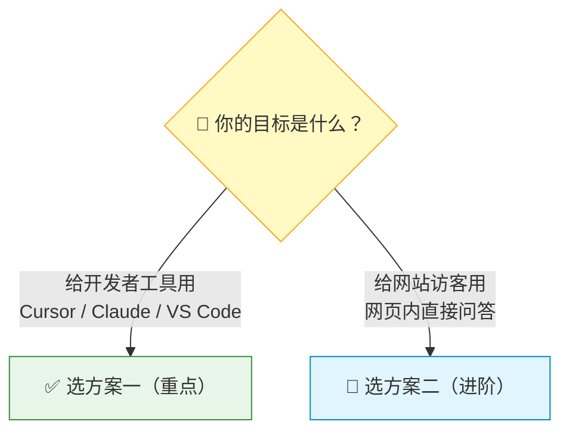

# 方案对比与选型

本教程提供两套方案，都基于 CNB 知识库接口封装，核心区别在于服务形态和使用场景。

## 一图理解

## 对比表

| | 方案一：EdgeOne MCP Server | 方案二：Go 服务 + 前端组件 |
|------|---------------------------|---------------------------|
| **定位** | 给外部 AI 工具使用 | 网页端 AI 问答 |
| **LLM 调用** | 由外部工具自带 | Go 后端调用（如 DeepSeek） |
| **服务器** | 无（EdgeOne 边缘函数） | 需自建或云服务器 |
| **前端改动** | 无需改动 VitePress | 需嵌入 AI 助手 Vue 组件 |
| **适用场景** | 开发者用 AI 工具查文档 | 终端用户在网页上问答 |
| **上线速度** | 快（推荐首选） | 中等（需要联调） |
| **运维复杂度** | 低 | 中-高 |
| **共同点** | 都封装 CNB 知识库接口 | 都封装 CNB 知识库接口 |

## 如何选择？

### 选方案一，如果你：

- 主要面向**开发者**用户
- 希望用户通过 Cursor、Claude Desktop 等 AI 工具检索文档
- 追求**零运维**、零服务器成本
- 只需要三个文件即可完成：`.cnb.yml` + `edgeone.json` + `cloud-functions/mcp/index.js`

### 选方案二，如果你：

- 希望在**网页端**直接提供 AI 问答体验
- 面向的是不使用 AI 开发工具的**终端用户**
- 愿意维护一个 Go 后端服务
- 需要更丰富的交互（思考链展示、流式回答、验证码等）

## 渐进式演进建议

1. 先上线**方案一**，最快拿到可用价值
2. 观察用户问题分布与调用频次
3. 再按需建设**方案二**，补齐网页端问答体验
4. 两套方案共享 CNB 知识库，统一维护文档数据源

## 延伸阅读

- [方案一：接入外部 AI 工具](./solution-mcp.md)
- [方案二：自建 Go 服务 RAG](./solution-rag.md)
- [架构全景图](./architecture.md)
- 博客文章：[将 VitePress 文档数据向量化，配合 RAG 实现 AI 助手插件](https://www.mintimate.cn/2025/08/24/knowledgeRagCnb/)
- Go 后端开源项目：[Knowledge Maker](https://github.com/Mintimate/knowledge-maker)
