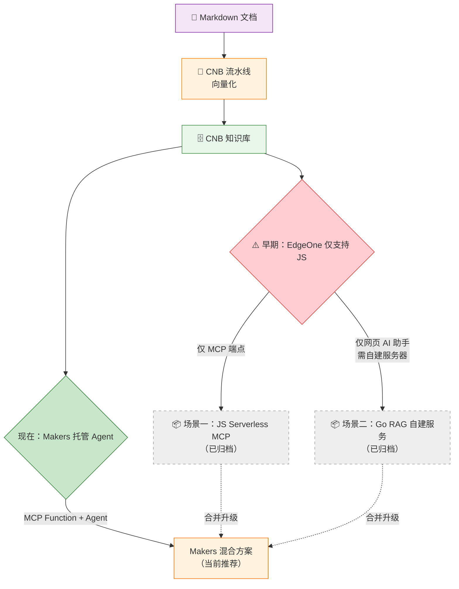

# 方案演进与对比

本项目基于 CNB 知识库的向量化流水线，当前推荐使用 **EdgeOne Makers：MCP Cloud Function + 托管 Agent** 方案。

## 演进背景

EdgeOne 平台早期没有当前的托管 Agent 能力，本项目先后采用过 JS MCP、自建 Go RAG，以及 Go Function 包办模型推理的方案。

- **场景一（JS Serverless MCP）**：用 JS 边缘函数实现 MCP Server，仅提供外部 AI 工具检索能力
- **场景二（Go RAG 自建服务）**：需要自建 Go 服务器，提供网页端 AI 问答

现在 EdgeOne Pages 已更名为 EdgeOne Makers，并能托管 Agent。本项目据此将模型推理、工具编排和会话记忆迁入 Agent，路径级 Node Function 专注于 MCP。

## 演进路径

## 方案对比表

| | JS Serverless MCP | Go RAG 自建服务 | Makers 混合方案（当前） |
|------|------------------------|-------------------------------|----------------------------|
| **状态** | ⚠️ 已归档 | ⚠️ 已归档 | ✅ **当前推荐** |
| **定位** | 仅外部 AI 工具检索 | 仅网页端 AI 问答 | MCP + 托管 Agent |
| **运行环境** | EdgeOne JS Function | 自建服务器 | EdgeOne Makers |
| **LLM 调用** | 由外部工具自带 | Go 后端调用 | Makers AI Gateway |
| **服务器** | 无（边缘函数） | 需自建 | 无（边缘函数） |
| **MCP 端点** | ✅ | ❌ | ✅ |
| **网页 AI 助手** | ❌ | ✅ | ✅ |
| **运维复杂度** | 低 | 中 ~ 高 | 低 |
| **共同基础** | CNB 知识库向量接口 | CNB 知识库向量接口 | CNB 知识库向量接口 |

## 当前推荐：Makers 混合方案

当前方案按运行时职责拆分，同时由一个 Makers 项目统一部署：

- ✅ 标准 MCP 端点（替代场景一）
- ✅ Makers 托管 Agent 与持久会话（替代场景二）
- ✅ 零服务器、零运维
- ✅ 全球 CDN 加速

👉 [前往 Makers 托管方案详情](./solution-go-function)

## 历史方案（已归档）

以下方案为早期实现，保留文档仅供参考。

### 场景一：JS Serverless MCP（已归档）

- 主要面向**开发者**用户
- 希望用户通过 Cursor、Claude Desktop 等 AI 工具检索文档
- 追求**零运维**、零服务器成本
- 仅提供 MCP 端点，不支持网页端 AI 助手
- 已被当前 Node Cloud Function 的 `/mcp` 路由替代

👉 [查看场景一历史文档](./solution-mcp)

### 场景二：Go RAG 自建服务（已归档）

- 需要自建服务器，运维成本较高
- 已被 Makers 托管 Agent 的 AI Gateway、会话与工具调用能力替代

👉 [查看场景二历史文档](./solution-rag)

## 在线体验

本项目已使用 EdgeOne Makers 部署，MCP 端点和网页端 Agent 均已上线：

🟢 [本站 MCP 端点（Live Demo）](./mcp-endpoint) — 复制配置即可在 AI 编辑器中体验

## 建议

1. **新项目**：直接采用 Makers 混合方案。
2. **已有 MCP**：可以保留协议实现，只把网页模型推理迁到 `agents/`。
3. **已有自建 RAG**：迁入 Makers Agent 后可下掉自建模型服务。
4. 所有方案共享 CNB 知识库，统一维护文档数据源

## 延伸阅读

- [架构全景图](./architecture)
- 博客文章：[将 VitePress 文档数据向量化，配合 RAG 实现 AI 助手插件](https://www.mintimate.cn/2025/08/24/knowledgeRagCnb/)
- Go 后端开源项目：[Knowledge Maker](https://cnb.cool/Mintimate/tool-forge/knowledge-maker)
- 当前教程：[EdgeOne Makers 与托管 Agent](/guide/cloud-function)
