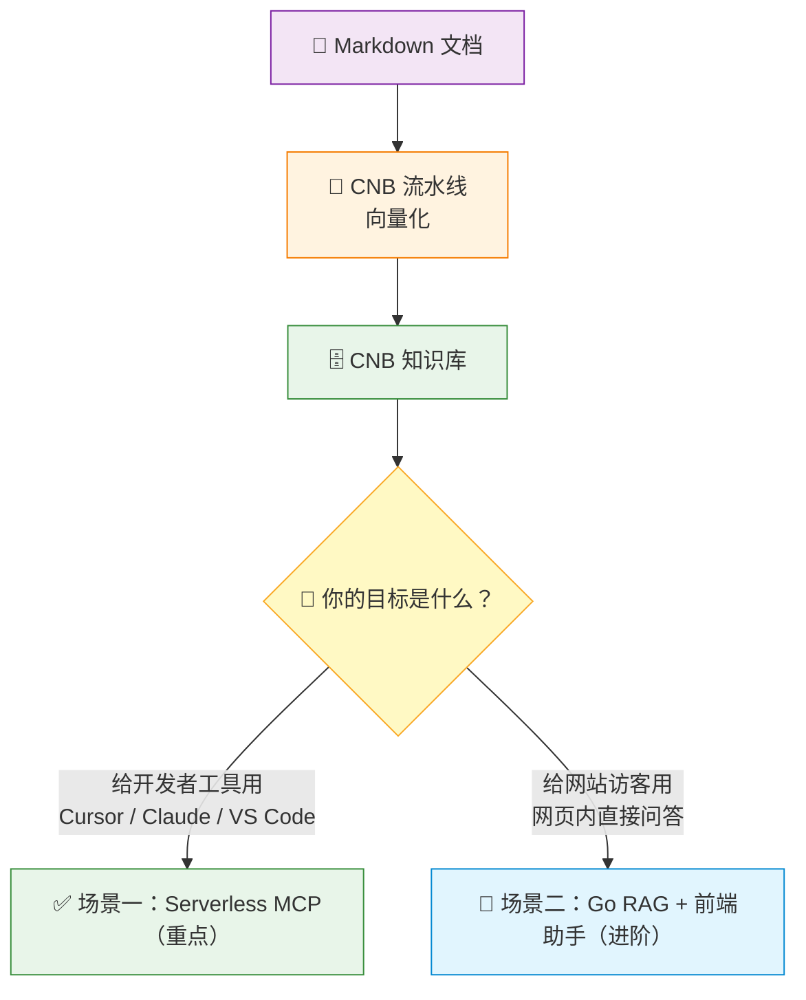

# 方案对比与选型

本项目基于 CNB 知识库的向量化流水线，提供**两种应用场景**，核心区别在于**服务形态**和**面向用户**。

## 一图理解

## 对比表

| | 场景一：Serverless MCP | 场景二：Go RAG + 前端 AI 助手 |
|------|------------------------|-------------------------------|
| **定位** | 给外部 AI 工具使用 | 网页端 AI 问答 |
| **LLM 调用** | 由外部工具自带 | Go 后端调用（如 DeepSeek） |
| **服务器** | 无（EdgeOne 边缘函数） | 需自建或云服务器 |
| **前端改动** | 无需改动 VitePress | 本项目已内置组件，需配置环境变量 |
| **适用场景** | 开发者用 AI 工具查文档 | 终端用户在网页上问答 |
| **上线速度** | ⚡ 快（推荐首选） | 中等（需要联调） |
| **运维复杂度** | 低 | 中 ~ 高 |
| **共同基础** | CNB 知识库向量接口 | CNB 知识库向量接口 |

## 如何选择？

### 选场景一，如果你：

- 主要面向**开发者**用户
- 希望用户通过 Cursor、Claude Desktop 等 AI 工具检索文档
- 追求**零运维**、零服务器成本
- 只需要三个文件即可完成：`.cnb.yml` + `edgeone.json` + `cloud-functions/mcp/index.js`

👉 [前往场景一详情](./solution-mcp)

### 选场景二，如果你：

- 希望在**网页端**直接提供 AI 问答体验
- 面向的是不使用 AI 开发工具的**终端用户**
- 愿意手动部署并维护一个 Go 后端服务
- 需要更丰富的交互（思考链展示、流式回答、验证码等）

👉 [前往场景二详情](./solution-rag)

## 在线体验

本项目自身就是场景一的真实产物，我们已经部署了一个可用的 MCP 端点：

🟢 [本站 MCP 端点（Live Demo）](./mcp-endpoint) — 复制配置即可在 AI 编辑器中体验

## 渐进式演进建议

1. 先上线**场景一**，最快拿到可用价值
2. 观察用户问题分布与调用频次
3. 再按需建设**场景二**，补齐网页端问答体验
4. 两种场景共享 CNB 知识库，统一维护文档数据源

## 延伸阅读

- [架构全景图](./architecture)
- 博客文章：[将 VitePress 文档数据向量化，配合 RAG 实现 AI 助手插件](https://www.mintimate.cn/2025/08/24/knowledgeRagCnb/)
- Go 后端开源项目：[Knowledge Maker](https://cnb.cool/Mintimate/tool-forge/knowledge-maker)
