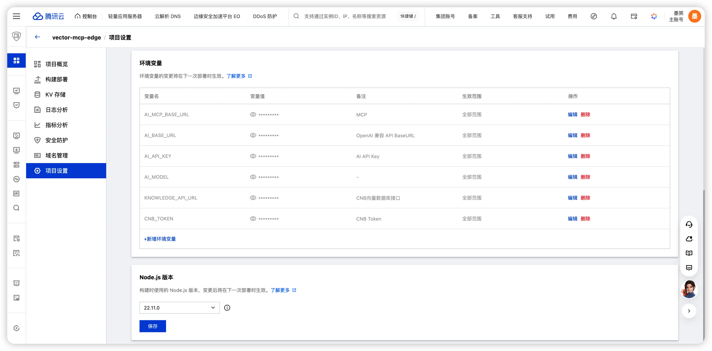
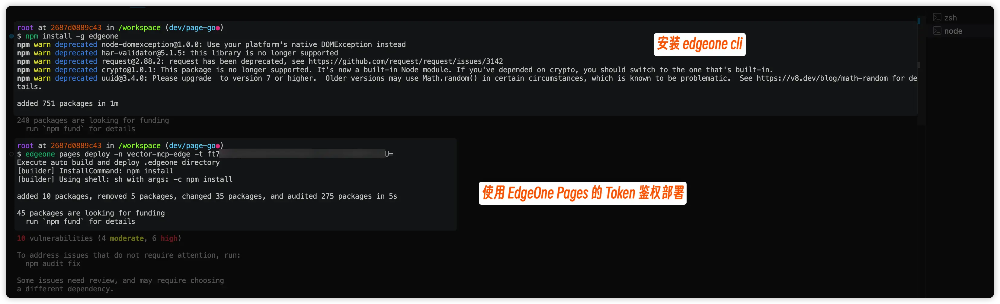
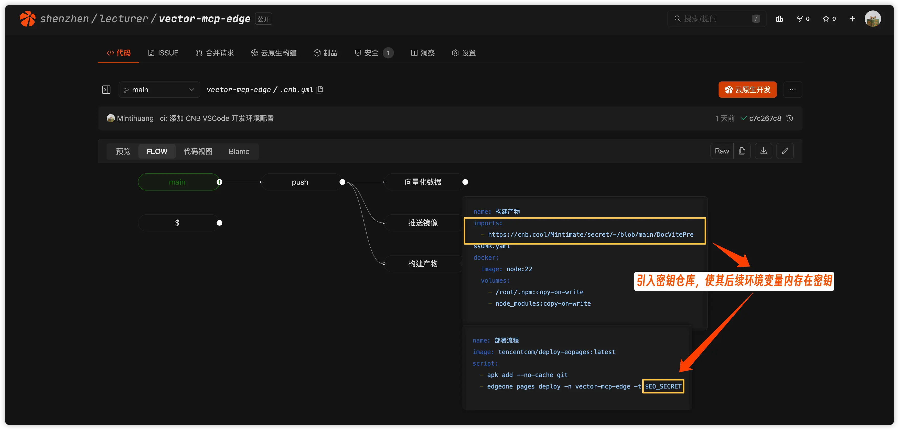
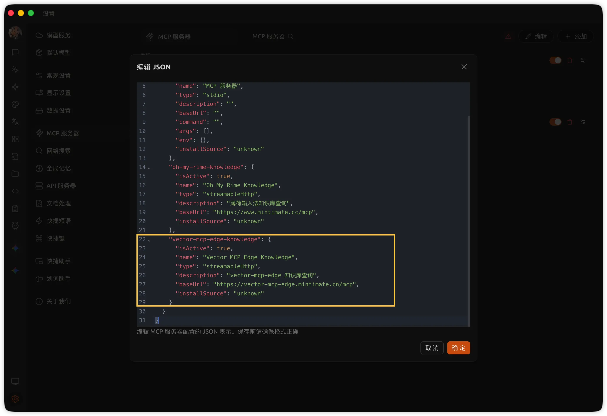

# Go Cloud Function 搭建教程

本教程将指导你使用 EdgeOne Pages 的 Go Cloud Function 能力，将 MCP Server、RAG 问答和 Tool Use 接口一体化部署在边缘函数上。

> ✅ **这是当前推荐方案**。早期 EdgeOne Pages 仅支持 JS Cloud Function，因此本项目最初将 MCP Server（JS）和网页端 AI 助手（自建 Go 服务器）分开实现。2026 年 4 月 EdgeOne Pages 新增 Go Cloud Function 支持后，两种方案已合并升级为本教程介绍的一体化方案。

## 前置条件

| 条件 | 说明 |
|------|------|
| **已完成主线教程** | 知识库向量化已跑通、EdgeOne Pages 已设置好 |
| **Go 1.22+** | 本地开发需要 Go 环境(如果你不想改任何内容或者测试，也可以不需要) |
| **LLM API** | 需要一个支持 Tool Calling 的大模型 API（如 DeepSeek、腾讯混元），也可使用 CNB 提供的 LLM API |
| **CNB 账号** | 已有 CNB 仓库和知识库 |

## 你将完成什么？

跟着本教程走完，你会得到：

1. ✅ 一个运行在 EdgeOne 边缘函数上的 Go 后端服务
2. ✅ 标准 MCP 端点（`/mcp`），供 Cursor、Claude 等 AI 工具接入
3. ✅ RAG 问答接口（`/api/v1/chat/stream`），支持流式输出
4. ✅ Tool Use 接口（`/api/v1/mcp/*`），供前端 AI 组件使用
5. ✅ 网页端 AI 助手正常工作

## 了解项目结构

Go Cloud Function 的代码位于 `cloud-functions/` 目录下：

```
cloud-functions/
├── go.mod                          # Go 模块定义
├── index.go                        # 入口文件（路由编排）
└── internal/
    ├── config/
    │   └── config.go               # 配置加载、CORS、AI 客户端
    ├── handler/
    │   ├── mcp.go                  # 标准 MCP Streamable HTTP
    │   ├── rag.go                  # RAG 问答（流式 / 非流式）
    │   ├── tooluse.go              # Tool Use 接口
    │   └── static/
    │       ├── project_info.md     # 项目信息
    │       ├── quickstart.md       # 快速开始指南
    │       └── solutions.md        # 方案对比
    └── knowledge/
        └── knowledge.go            # CNB 知识库查询
```

::: tip EdgeOne Pages Go Function 约定
EdgeOne Pages 的 Go Cloud Function 要求入口文件（`index.go`）必须在 `cloud-functions/` 根目录下，包名为 `main`，并包含 `main()` 函数。部署时会自动编译并运行。
:::

## 配置环境变量

Go Cloud Function 通过环境变量获取运行时配置。在 EdgeOne Pages 的项目设置中添加以下环境变量：

| 变量名 | 必填 | 说明 | 示例 |
|--------|------|------|------|
| `KNOWLEDGE_API_URL` | 是 | CNB 知识库查询 API | `https://api.cnb.cool/<用户名>/<仓库组>/<仓库名>/-/knowledge/base/query` |
| `CNB_TOKEN` | 自动 | CNB 访问令牌 | EdgeOne Pages 自动注入 |
| `AI_BASE_URL` | 是 | OpenAI 规范的 LLM API | CNB 有提供免费的 AI 接口，参考: [AI 对话](https://api.cnb.cool/#/operations/AiChatCompletions) ，示例值: `https://api.cnb.cool/<组织>/<项目>/-/ai` |
| `AI_API_KEY` | 是 | LLM API 密钥 | 你的 API Key |
| `AI_MODEL` | 是 | 模型名称 | `hunyuan-t1-20250711` |
| `RAG_SYSTEM_PROMPT` | 否 | 自定义系统提示词 | 见下方示例 |

### 系统提示词示例

```
你是一个专业的知识库助手，请根据提供的知识库内容回答用户的问题。
如果知识库中没有相关内容，请如实告知用户。
请使用用户提问的语言进行回答。
```

::: warning 密钥安全
`AI_API_KEY` 等敏感信息应通过 EdgeOne Pages 的环境变量配置界面设置，**不要**硬编码在代码中或提交到 Git 仓库。


:::

## 理解核心代码

### 入口文件 `index.go`

入口文件负责初始化配置、创建 AI 客户端，并注册所有路由：

```go
func main() {
    gin.SetMode(gin.ReleaseMode)
    cfg := config.Load()
    aiClient := config.NewAIClient(cfg)

    r := gin.New()
    r.Use(gin.Recovery())
    r.Use(config.CORSMiddleware())

    registerRoutes(r, cfg, aiClient)
    r.Run(":9000")
}
```

### MCP 端点 `handler/mcp.go`

实现标准 MCP Streamable HTTP 协议，支持 `initialize`、`ping`、`tools/list`、`tools/call` 等方法：

- **GET /mcp** — 服务发现，返回服务器信息和可用工具摘要
- **POST /mcp** — JSON-RPC 2.0 请求处理，支持 JSON 和 SSE 两种响应格式
- **DELETE /mcp** — 会话终止（空操作）

内置 4 个 MCP 工具：

| 工具名 | 说明 |
|--------|------|
| `query_knowledge_base` | 语义搜索知识库 |
| `get_project_info` | 获取项目概览 |
| `get_quickstart` | 获取快速开始指南 |
| `get_solutions` | 获取方案对比 |

### RAG 问答 `handler/rag.go`

提供两种 RAG 问答模式：

- **POST /api/v1/chat** — 非流式：查询知识库 → 调用 LLM → 返回完整回答
- **POST /api/v1/chat/stream** — 流式（SSE）：支持 DeepSeek-R1 风格的思考链（`<think>`/`<answer>` 标记）

### Tool Use `handler/tooluse.go`

为前端 AI 组件提供 Function Calling 流程：

- **GET /api/v1/mcp/tools** — 返回工具列表（仅 `query_knowledge_base`）
- **POST /api/v1/mcp/tools/call** — 执行单个工具
- **POST /api/v1/mcp/llm/chat** — LLM 聊天，支持流式和非流式，自动处理 Tool Calling

::: tip MCP 与 Tool Use 的区别
`/mcp` 端点提供全部 4 个 MCP 工具，供外部 AI 客户端（Cursor、Claude 等）使用；而 `/api/v1/mcp/*` 是内部接口，仅提供 `query_knowledge_base` 工具供网页端 AI 助手使用。
:::

## 本地开发与测试

### 启动本地开发服务

```bash
cd cloud-functions
export KNOWLEDGE_API_URL="https://api.cnb.cool/<用户名>/<仓库组>/<仓库名>/-/knowledge/base/query"
export CNB_TOKEN="<你的CNB Token>"
export AI_BASE_URL="<你的LLM API地址>"
export AI_API_KEY="<你的API Key>"
export AI_MODEL="<模型名称>"
go run .
```

服务将在 `http://localhost:9000` 启动。

### 验证接口

```bash
# 健康检查
curl http://localhost:9000/api/v1/health

# 查看 MCP 服务信息
curl http://localhost:9000/mcp

# MCP 初始化握手
curl -X POST http://localhost:9000/mcp \
  -H "Content-Type: application/json" \
  -d '{"jsonrpc":"2.0","id":1,"method":"initialize","params":{"protocolVersion":"2025-03-26","capabilities":{},"clientInfo":{"name":"test","version":"1.0"}}}'

# 调用知识库搜索工具
curl -X POST http://localhost:9000/mcp \
  -H "Content-Type: application/json" \
  -d '{"jsonrpc":"2.0","id":2,"method":"tools/call","params":{"name":"query_knowledge_base","arguments":{"query":"如何部署到 EdgeOne Pages"}}}'

# 测试 Tool Use 工具列表
curl http://localhost:9000/api/v1/mcp/tools

# 测试 RAG 问答
curl -X POST http://localhost:9000/api/v1/chat \
  -H "Content-Type: application/json" \
  -d '{"Query":"MCP 是什么？"}'
```

## 部署到 EdgeOne Pages

部署到 EdgeOne Pages 并激活 Cloud Function，核心依赖 [EdgeOne CLI](https://pages.edgeone.ai/zh/document/edgeone-cli)。你可以在本地手动部署，也可以通过 CNB 流水线自动部署。

### 确认 `edgeone.json` 配置

确保项目根目录的 `edgeone.json` 配置正确：

```json
{
    "name": "vector-mcp-edge",
    "buildCommand": "npm run build",
    "installCommand": "npm install",
    "outputDirectory": ".vitepress/dist",
    "nodeVersion": "22.11.0"
}
```

执行 `edgeone pages deploy` 时，CLI 会根据此配置自动构建项目，并检测 `cloud-functions/` 目录下的 Go 代码一并编译部署。

### 方式一：本地手动部署

安装 EdgeOne CLI 并登录后，直接在项目根目录执行部署命令：

```bash
# 安装 EdgeOne CLI
npm install -g edgeone

# 登录（在弹出的浏览器窗口完成认证）
edgeone login

# 部署到生产环境
edgeone pages deploy -n vector-mcp-edge
```

::: tip
更多 CLI 用法（本地开发调试、环境变量管理等）请参考 [EdgeOne CLI 文档](https://pages.edgeone.ai/zh/document/edgeone-cli)。比如，使用 token 方式部署：

```bash
edgeone pages deploy -n vector-mcp-edge -t <你的API Token>
```



其实这个方法更适合 CI/CD 场景，后续我们会介绍如何在 CNB 流水线中使用 token 实现自动部署。

:::

### 方式二：CNB 流水线自动部署（推荐）

利用 CNB 的 [EdgeOne Pages 部署插件](https://cnb.cool/cnb/plugins/tencentcom/deploy-eopages)，可以在 `.cnb.yml` 中配置流水线，实现 `git push` 后自动部署。

**前置准备**：
1. 在 EdgeOne Pages 控制台获取 [API Token](https://pages.edgeone.ai/zh/document/api-token)
2. 将 API Token 存入 CNB 密钥仓库（如变量名 `EO_SECRET`）

**`.cnb.yml` 部署配置示例**：

```yaml
main:
  push:
    - name: "向量化数据"
      stages:
        - name: build knowledge base
          image: cnbcool/knowledge-base
          settings:
            include: "**/**.md"
    - name: "构建产物"
      docker:
        image: node:22
      stages:
        - name: "部署流程"
          image: tencentcom/deploy-eopages:latest
          script:
            - apk add --no-cache git
            - edgeone pages deploy -n vector-mcp-edge -t $EO_SECRET
```



::: info 部署插件说明
`tencentcom/deploy-eopages` 镜像内置了 EdgeOne CLI，通过 `edgeone pages deploy` 命令完成部署。CLI 会自动执行构建（根据 `edgeone.json` 配置）并上传产物，同时编译 `cloud-functions/` 下的 Go Cloud Function。
:::

### 推送触发部署

```bash
git add .
git commit -m "feat: 新增 Go Cloud Function AI 助手"
git push
```

推送后 CNB 流水线会自动触发：
1. 知识库向量化（`cnbcool/knowledge-base`）
2. VitePress 站点构建 + Go Cloud Function 编译
3. EdgeOne Pages 部署（`edgeone pages deploy`）

## 配置前端 AI 助手

Go Cloud Function 部署后，前端 AI 助手组件可以直接连接。在部署环境中配置以下环境变量：

| 变量名 | 说明 | 示例 |
|--------|------|------|
| `AI_MCP_BASE_URL` | Go Function 的 Tool Use 接口地址 | `https://<你的域名>/api/v1/mcp` |

::: tip 同域部署
由于 Go Cloud Function 和 VitePress 站点部署在同一个 EdgeOne Pages 项目中，前端可以直接使用相对路径或同域地址访问后端接口，无需额外处理跨域问题。
:::

## 配置外部 AI 工具

部署完成后，外部 AI 工具可以通过 MCP 端点接入：

::: code-group

```json [Cursor (.cursor/mcp.json)]
{
  "mcpServers": {
    "my-docs": {
      "url": "https://<你的域名>/mcp",
      "transport": "streamable-http"
    }
  }
}
```

```json [VS Code (.vscode/mcp.json)]
{
  "servers": {
    "my-docs": {
      "type": "http",
      "url": "https://<你的域名>/mcp"
    }
  }
}
```

```json [Claude Desktop]
{
  "mcpServers": {
    "my-docs": {
      "url": "https://<你的域名>/mcp",
      "transport": "streamable-http"
    }
  }
}
```

比如，在 Cherry Studio 中添加 MCP Server：



:::

## 从历史方案迁移

如果你之前使用的是 JS Cloud Function（场景一）或自建 Go 服务器（场景二），迁移到 Go Cloud Function 非常简单：

1. **删除** `cloud-functions/mcp/index.js`（JS MCP Server 已不再需要）
2. **新增** `cloud-functions/index.go` 和 `cloud-functions/internal/` 目录
3. **配置环境变量**：新增 `AI_BASE_URL`、`AI_API_KEY`、`AI_MODEL` 等
4. **推送部署**：EdgeOne Pages 会自动检测并编译 Go Function
5. **如果之前是场景二**：可以下掉自建的 Go 服务器，Go Cloud Function 已完全替代其功能

::: warning 路由替代
Go Cloud Function 的 `/mcp` 路由已完全替代 JS 版本的 MCP Server。迁移后建议删除 `cloud-functions/mcp/index.js`，避免混淆。
:::

## 常见问题

### Go Function 编译失败

- 确认 `go.mod` 中的 Go 版本 ≥ 1.22
- 确认 `index.go` 在 `cloud-functions/` 根目录下
- 确认包名为 `main` 且包含 `main()` 函数

### 环境变量未生效

- 在 EdgeOne Pages 项目设置中检查环境变量是否正确配置
- `CNB_TOKEN` 由平台自动注入，无需手动配置
- 修改环境变量后需要重新部署才能生效

### 前端 AI 助手无法连接

- 确认 `AI_MCP_BASE_URL` 指向正确的地址
- 检查 CORS 配置是否允许前端域名访问
- 使用 `curl` 测试 `/api/v1/mcp/tools` 是否正常返回

## 相关文档

- [配置网页端 AI 助手](./ai-assistant) — 详细的前端组件配置
- [扩展更多 MCP 工具](./extend-tools) — 为 Go Function 添加更多工具
- [最佳实践](./best-practices) — 生产环境优化建议
- [Go Cloud Function 方案详情](/features/solution-go-function) — 了解完整的架构设计
