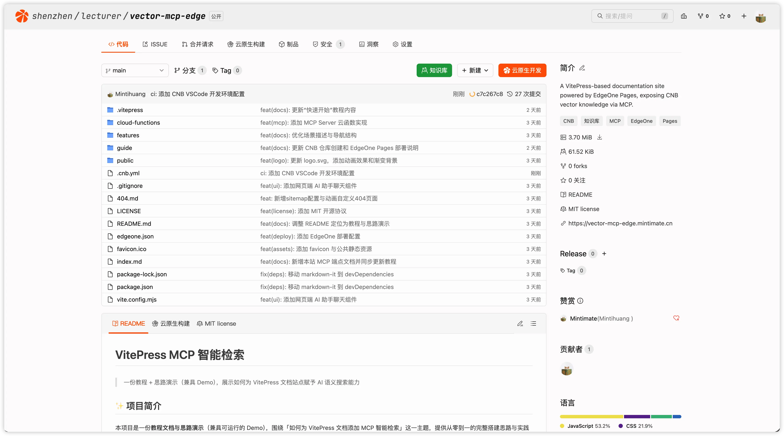
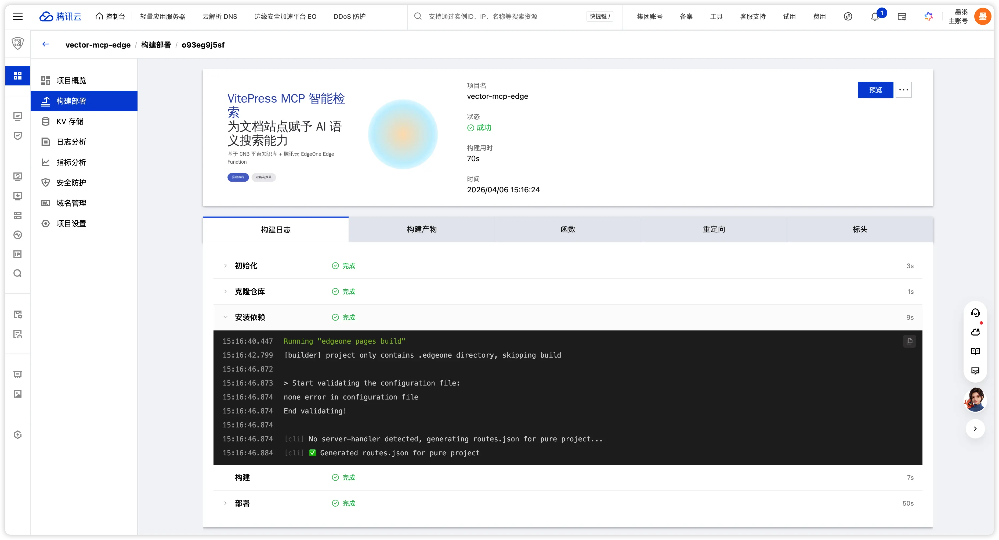
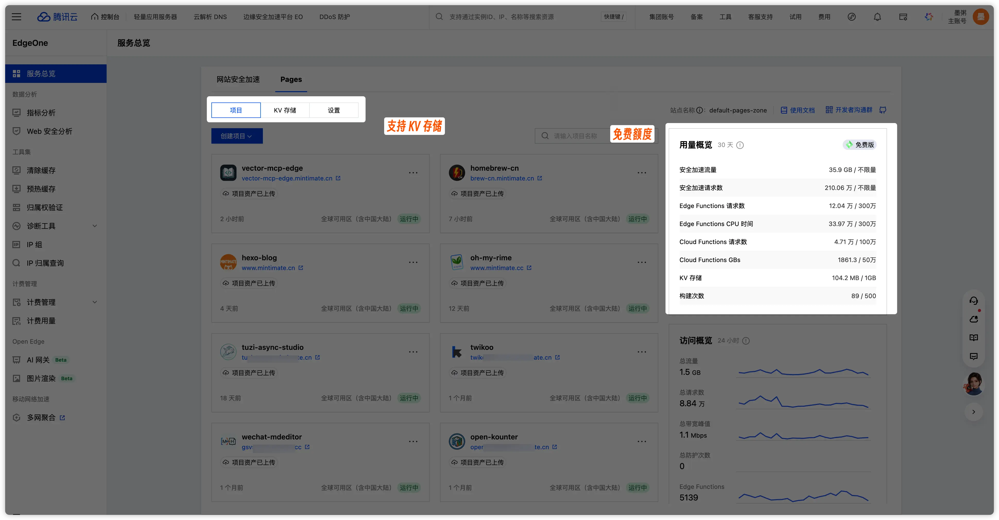

# 托管到 CNB 平台

CNB 不仅仅是一个 Git 仓库，更是一个**集代码托管、CI/CD、知识库、边缘部署于一体的云原生开发平台**。

## 创建 CNB 仓库

1. 访问 [cnb.cool](https://cnb.cool)，注册并登录、创建组织。
2. 创建一个新仓库，例如 `my-docs`，初始化为 VitePress 项目。
3. 将本地项目推送到 CNB：

```bash
git init
// VitePress 项目初始化部分省略，参考 [VitePress 快速开始](https://vitepress.dev/guide/getting-started)
git add .
git commit -m "init: vitepress project"
git remote add origin https://cnb.cool/<你的组织名称>/my-docs.git
git push -u origin main
```

比如本项目的 CNB 仓库地址为：https://cnb.cool/shenzhen/lecturer/vector-mcp-edge，提交后的 Git 仓库界面为(截图自: [c7c267c870](https://cnb.cool/shenzhen/lecturer/vector-mcp-edge/-/commit/c7c267c870d8f1985b37952171192b71a7fc79d0)):



## 配置 EdgeOne Pages 部署

当前使用 EdgeOne Pages 作为边缘部署平台，主要两个好处：
1. VitePress 就是基于 Node.js 的，可以直接部署在 EdgeOne Pages 上，并且支持 Cloud Function 服务。
2. 部署速度快，全球 CDN 加速，支持自定义域名和 HTTPS。

在项目根目录创建 `edgeone.json`：

```json
{
    "name": "my-docs",
    "buildCommand": "npm run build",
    "installCommand": "npm install",
    "outputDirectory": ".vitepress/dist",
    "nodeVersion": "22.11.0"
}
```

| 字段 | 说明 |
|------|------|
| `buildCommand` | 构建命令，即 `vitepress build` |
| `outputDirectory` | VitePress 默认的构建输出目录 |
| `nodeVersion` | 指定 Node.js 版本 |

详细的内容请参考 [EdgeOne Pages 项目指南](https://pages.edgeone.ai/zh/document/edgeone-json)。

后续的 EdgeOne Pages 触发后，会自动进行部署:



## 为什么选择 CNB？

CNB（Cloud Native Build）是腾讯云推出的云原生构建平台，不仅仅是一个 Git 仓库，更是集代码托管、CI/CD、知识库、AI 能力、边缘部署于一体的云原生开发平台。详细介绍请参考 [CNB 官方文档](https://docs.cnb.cool/zh/)。

| 特性 | CNB 平台优势 | 传统方案 |
|------|-------------|----------|
| **知识库 & 向量化** | 内置向量化流水线，`.cnb.yml` 几行配置即可将文档自动分块、Embedding、构建语义索引 | 需自建向量数据库（Pinecone / Milvus），编写分块逻辑，调用 Embedding 模型 |
| **AI / LLM 能力** | 平台内置 LLM API（如混元），支持 AI 代码助手，可直接用于 AI 辅助编程 | 需自行申请和管理第三方 LLM API Key |
| **CI/CD 流水线** | 声明式 `.cnb.yml`，代码 push 即触发；基于 Docker 生态，支持 CoW 秒级克隆与构建加速 | 需编写复杂的 GitHub Actions 或 Jenkins Pipeline |
| **云原生开发环境** | 秒级启动云端 IDE（VS Code / JetBrains），无需本地环境配置 | 需本地安装开发环境，配置工具链 |
| **制品库** | 内置 Docker 镜像制品库和 Helm 制品库，流水线中一键推送 | 需额外搭建或购买镜像仓库服务 |
| **一站式体验** | 代码托管 → 知识库向量化 → 构建部署 → MCP / RAG 服务，全链路打通 | 需拼凑 GitHub + Pinecone + Vercel + 多个平台 |

## 为什么选择 EdgeOne Pages？

[EdgeOne Pages](https://pages.edgeone.ai/zh) 是腾讯云推出的**边缘全栈开发平台**，基于云边一体化架构，融合托管、加速、计算与集成能力。在本项目中，我们使用 EdgeOne Pages 部署 VitePress 静态站点和 MCP Server（Cloud Function）。

| 特性 | 说明 |
|------|------|
| **全球边缘网络** | 3200+ 边缘节点，400 Tbps 带宽，延迟 <50ms，一次部署全球分发 |
| **Edge Functions** | 无需管理服务器，通过 JavaScript 在边缘节点编写超低延时的服务端逻辑，本项目的 MCP Server 正是基于此实现 |
| **Node Services** | 基于原生 Node.js Functions，支持 Next.js SSR / ISR 等全栈能力，按需自动扩缩容 |
| **Edge AI** | 在边缘节点部署 AI 推理服务，内置 DeepSeek 等模型支持，低延迟、零维护 |
| **Edge KV** | 多边缘节点部署的 KV 持久化数据存储，支持全球范围内读写数据 |
| **灵活部署方式** | 支持 Git 连接自动部署、CLI 工具部署、MCP / AI IDE 插件一键部署 |
| **协作开发** | 支持团队分支协作与实时预览，随时查看代码效果 |
| **免费额度** | 提供免费使用额度，个人项目和小型站点零成本上线 |



::: tip 本项目为什么用 EdgeOne Pages？
1. VitePress 基于 Node.js，可以直接部署静态站点到 EdgeOne Pages
2. Cloud Function 支持在边缘运行 MCP Server，零服务器成本
3. 与 CNB 流水线配合，`git push` 即可自动构建部署
4. 全球 CDN 加速，支持自定义域名和 HTTPS
:::

## 下一步

- [配置知识库向量化](./knowledge-base.md)
