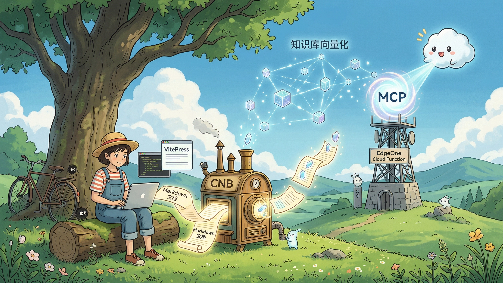

# 快速开始

本教程的前提是：**你已经有一个 VitePress（或其他 Markdown）文档项目**。接下来把它托管到 CNB，激活知识库向量化，再通过 EdgeOne Makers 部署 MCP Cloud Function 与网页端 Agent。

> 💡 如果你还没有 VitePress 项目，可以参考 [VitePress 官方文档](https://vitepress.dev/zh/guide/getting-started) 快速创建一个。

## 这份教程适合谁？

- **文档维护者**：希望给已有的 VitePress 文档站增加 AI 语义检索能力
- **开发者工具用户**：希望在 Cursor / Claude Desktop / VS Code 中直接检索文档
- **站点建设者**：希望用 Makers 托管 Agent 集成网页聊天助手

## 前置条件

| 条件 | 说明 |
|------|------|
| **已有 VitePress 项目** | 本地能正常 `npm run dev` 启动 |
| **CNB 账号** | 访问 [cnb.cool](https://cnb.cool) 注册账号和组织 |
| **Node.js >= 18** | 推荐 22 LTS |

## 你将完成什么？

跟着主线教程走完，你会得到：

1. ✅ 文档项目托管在 CNB，Git 推送自动触发知识库向量化
2. ✅ 一个可用的 MCP Server 端点，部署在 Makers Node Cloud Function 上
3. ✅ AI 工具（Cursor、Claude 等）可以直接检索你的文档内容
4. ✅ 网页端 AI 助手正常工作（Makers Agent + AI Gateway + Store）

整个过程大约 **20 分钟**：

- **第 5 分钟**：项目托管到 CNB，流水线配置完成
- **第 15 分钟**：CNB 知识库向量化跑通，文档已建立索引
- **第 20 分钟**：MCP Server 部署完成，`curl` 可测试调用并返回结果

## 扩展部分：网页端 AI 助手

托管 Agent 已内置知识库工具、流式问答和会话记忆，前端 AI 助手组件直接连接 `/chat`。

详见 [EdgeOne Makers 与托管 Agent](./cloud-function)。

::: details 📜 历史方案：自建 Go 后端
早期网页端 AI 助手需要自建 Go 服务器。现在 Makers 托管 Agent 已替代该方案，无需自建服务器。

如果你有特殊需求（如私有化部署），仍可参考 [场景二：Go RAG 网页助手](../features/solution-rag.md)（已归档）。
:::

> 💡 **建议**：跑通知识库向量化后，继续完成 [Makers 与托管 Agent](./cloud-function)，一步获得 MCP + 网页端 AI 助手能力。

## 主线教程

按顺序完成以下步骤：

1. **[托管到 CNB](./deploy-cnb.md)** — 将项目推送到 CNB 平台
2. **[知识库向量化](./knowledge-base.md)** — 配置流水线，自动将 Markdown 分块并向量化
3. **[Makers 与托管 Agent](./cloud-function.md)** — 部署 MCP 与网页 Agent
4. **[部署与验证](./deploy-verify.md)** — 部署到 EdgeOne Makers，验证端到端可用

## 常见起步问题

- **我的项目不是 VitePress 怎么办？** — 只要是 Markdown 文档项目，CNB 知识库都支持向量化，流程一样
- **我还没有 CNB 账号** — 访问 [cnb.cool](https://cnb.cool) 注册，支持微信/GitHub 登录
- **我想先看看效果再动手** — 前往 [本站 MCP 端点（Live Demo）](../features/mcp-endpoint) 直接体验
