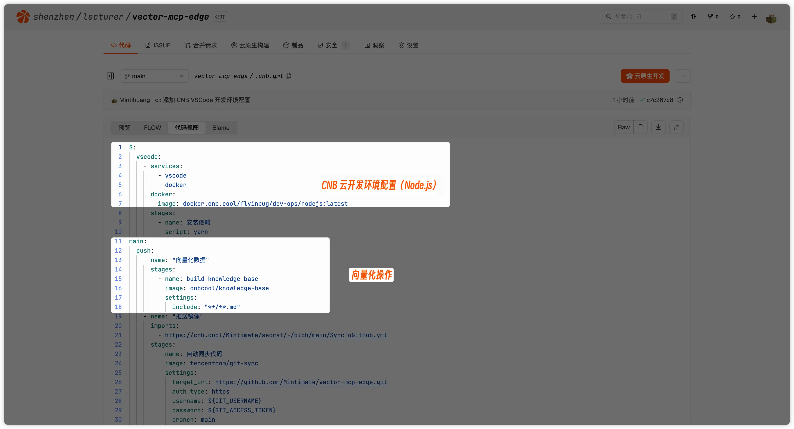
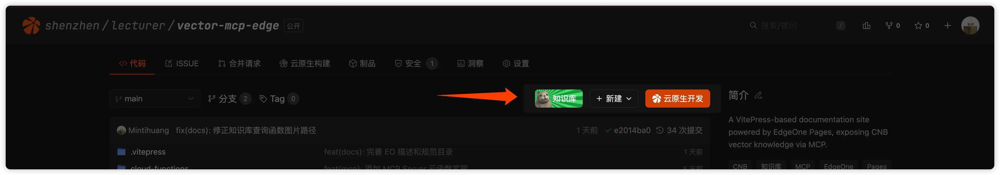
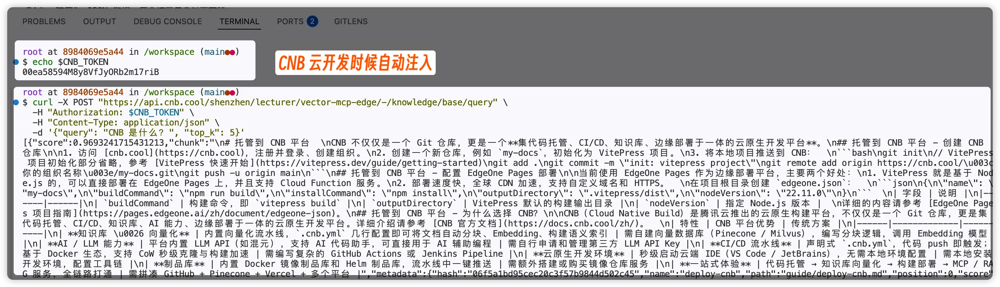
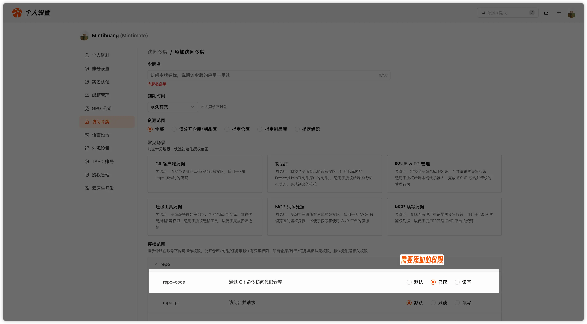
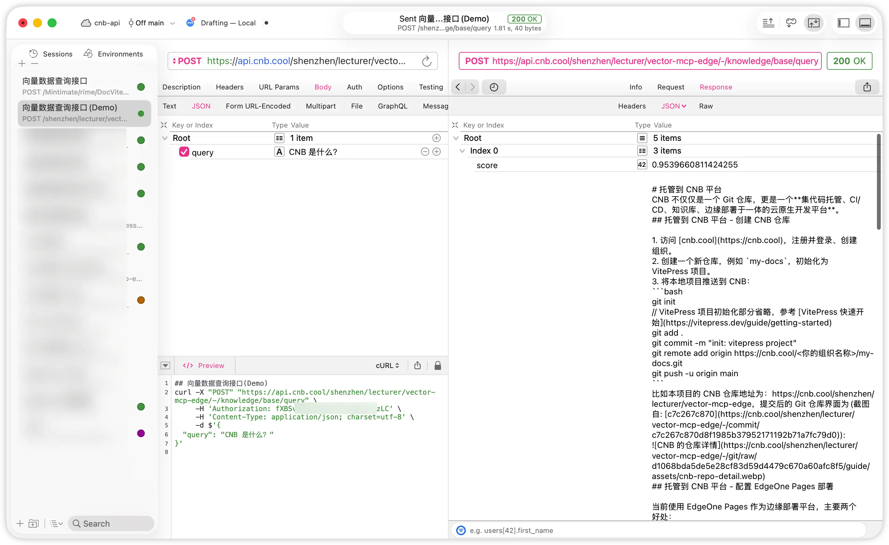

# 知识库向量化

CNB 平台提供了开箱即用的[插件](https://docs.cnb.cool/zh/build/internal-steps.html)，类似于 GitHub 的 Action。不同的是，CNB 底层基于云原生，也就是容器化，所以插件的运行环境是 Docker 镜像。但是 GitHub Actions 的运行环境是 KVM 虚拟机。

两个方案，我个人是比较喜欢 CNB 的形式，云原生相比 KVM 虚拟机，在性能上有明显的优势。当然，也有弊端，GitHub Action 环境是可以使用 macOS、Windows 的。


[知识库能力](https://docs.cnb.cool/zh/plugin/#public/cnbcool/knowledge-base)，就是 CNB 官方提供的插件，我们可以在根目录下的`.cnb.yml`中使用。

本章节目标:
- 配置项目的 `.cnb.yml` 文件，添加知识库向量化插件。
- 获取 `CNB_TOKEN` 并请求知识库 API。

## 配置 `.cnb.yml`

在项目根目录创建 `.cnb.yml`，配置流水线：

```yaml
main:
  push:
    - name: "向量化数据"
      stages:
        - name: build knowledge base
          image: cnbcool/knowledge-base
          settings:
            include: "**/**.md"
```

解释一下各个参数的含义：
- `main` 是默认分支，即 `main` 分支的的事件会触发接下来的流水线。
- `push` 是事件类型，即 `push` 事件会触发流水线。
- `build knowledge base` 是阶段名称，用于在流水线中区分不同的阶段
- `image` 是插件名称，即 `cnbcool/knowledge-base`
- `settings` 是插件参数，即 `include` 参数用于指定要向量化的文件路径，这里是向量全项目内的所有 Markdown 文件。更多配置项（如排除文件、分块大小、Issue 同步等）请参考[知识库插件文档](https://docs.cnb.cool/zh/plugin/#public/cnbcool/knowledge-base)。

> 支持的文档格式：Markdown、MDX、PDF、DOCX、TXT（根据后缀名判断）。



## 知识库 API

向量化完成后，CNB 仓库前台会出现知识库的按钮：



这意味着，项目的 Markdown 文档已经被向量化了，我们可以通过 API 来查询这些向量化后的内容。参考 [知识库 API 文档](https://api.cnb.cool/#/operations/QueryKnowledgeBase)，API 请求格式如下：

```
POST https://api.cnb.cool/<用户名>/<仓库组>/<仓库名>/-/knowledge/base/query
```

> `{slug}` 应替换为仓库 slug，例如仓库地址为 `https://cnb.cool/cnb/docs`，则 slug 为 `cnb/docs`。

### 请求参数

| 参数 | 类型 | 必填 | 说明 |
|------|------|------|------|
| `query` | string | ✅ | 语义搜索的自然语言查询 |
| `top_k` | number | ❌ | 返回结果数量，默认 5 |
| `score_threshold` | number | ❌ | 匹配相关性分数阈值，默认 0 |

### 请求示例

```bash
curl -X POST "https://api.cnb.cool/<用户名>/<仓库组>/<仓库名>/-/knowledge/base/query" \
  -H "Authorization: $CNB_TOKEN" \
  -H "Content-Type: application/json" \
  -d '{"query": "如何安装", "top_k": 5}'
```

::: info 鉴权配置
CNB 平台会在流水线和云原生运行时自动注入 `CNB_TOKEN` 环境变量，你无需手动创建 `CNB_TOKEN`:



但是在正式的环境中，你需要先生成一个 [访问令牌](https://cnb.cool/profile/token) 作为 `CNB_TOKEN` 的支持，并且对请求仓库有读取的权限:



:::

比如，我用 RapidAPI 调用知识库 API，请求参数如下：



### 响应格式

响应为 JSON 数组，每个结果包含以下字段：

| 字段 | 类型 | 说明 |
|------|------|------|
| `score` | number | 匹配相关性分数，范围 0-1，越高表示匹配度越高 |
| `chunk` | string | 匹配到的知识库内容片段（Markdown 格式） |
| `metadata` | object | 内容元数据 |

#### metadata 字段详情

| 字段 | 类型 | 说明 |
|------|------|------|
| `hash` | string | 内容的唯一哈希值 |
| `name` | string | 文档名称 |
| `path` | string | 文档路径 |
| `position` | number | 内容在原文档中的位置 |
| `type` | string | 内容类型，如 `code`、`issue` |
| `url` | string | 内容 URL |

### 响应示例

```json
[
  {
    "score": 0.9539660811424255,
    "chunk": "# 托管到 CNB 平台...",
    "metadata": {
      "hash": "a89429226284ea2c91a1dc162ae42c81",
      "name": "deploy-cnb",
      "path": "guide/deploy-cnb.md",
      "position": 0,
      "type": "code",
      "url": "https://cnb.cool/..."
    }
  }
]
```


## 下一步

- [编写 MCP Server](./mcp-server.md)
