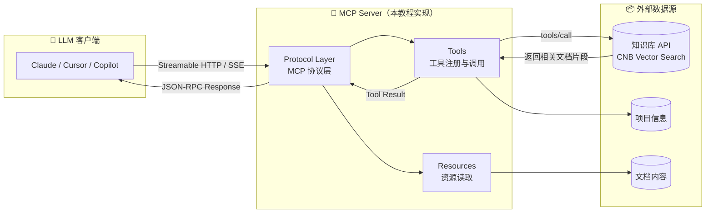
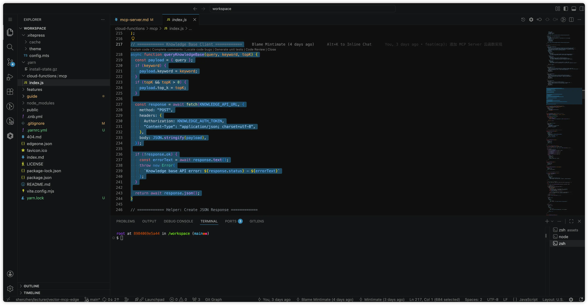

# Edge Function 实现 MCP Server（JS 版，已归档）

> ⚠️ **本页介绍的是早期 JS 实现**。当前代码已重写为 `cloud-functions/mcp.js` 并与 Makers 托管 Agent 配合，保留本页仅供历史参考。
>
> 👉 推荐前往 [EdgeOne Makers 与托管 Agent](./cloud-function) 查看当前方案。

---

> 以下为历史内容。当前 MCP 仍使用 Node Function，但文件路由、环境变量和 Agent 分工已经更新。

我们将在 EdgeOne Makers 的 Cloud Function 中实现一个完整的 MCP Server。

其实，MCP Server 的实现并不复杂，只需要按照 MCP 协议的规范来实现即可。但是，为了让实现更符合实际场景，我们还需要考虑一些额外的细节。

::: tip 当前推荐：Makers 混合方案
路径级 Node Cloud Function 提供 MCP，托管 Agent 提供模型推理与会话。前往 [EdgeOne Makers 与托管 Agent](./cloud-function) 查看当前方案。
:::

## MCP 协议简介

[MCP（Model Context Protocol）](https://modelcontextprotocol.io/) 是一个开放协议，用于标准化 AI 应用与外部数据源/工具之间的通信：

- **Tools**：AI 可以调用的工具（如搜索、查询）
- **Resources**：AI 可以读取的资源
- **Transport**：通信方式（本教程使用 Streamable HTTP）



## 创建 Edge Function

EdgeOne Makers 支持路径级 Node Cloud Function。本节使用 Node Function 包装上游 CNB 知识库 API，实现 MCP Server；当前完整架构请参考 [Makers 与托管 Agent](./cloud-function)。

EdgeOne Makers 会在部署的时候，自动扫描`cloud-function`下的文件，完成 Cloud function 的构建，所以我们创建一个`cloud-functions/mcp`的文件夹，在里面创建一个`index.js`的文件，用于实现 MCP Server。

```bash
mkdir -p cloud-functions/mcp
```

## 关键代码讲解

### 常量与配置

```javascript
// 知识库 API 地址（替换为你自己的仓库路径）
const KNOWLEDGE_API_URL =
  "https://api.cnb.cool/<用户名>/<仓库组>/<仓库名>/-/knowledge/base/query";

// CNB 平台会自动注入此环境变量，无需手动配置
const KNOWLEDGE_AUTH_TOKEN = process.env.CNB_TOKEN;

const SERVER_INFO = { name: "my-docs-mcp", version: "1.0.0" };
const SUPPORTED_PROTOCOL_VERSION = "2025-03-26";
```

### 定义 MCP Tools

```javascript
const TOOLS = [
  {
    name: "query_knowledge_base",
    description:
      "Search the documentation knowledge base using semantic vector search. " +
      "Supports both semantic query and keyword-based search.",
    inputSchema: {
      type: "object",
      properties: {
        query: {
          type: "string",
          description: "The search query in natural language.",
        },
        keyword: {
          type: "string",
          description: "Optional keywords, separated by semicolons.",
        },
        top_k: {
          type: "number",
          description: "Max results to return (default: 5, range: 1-10).",
        },
      },
      required: ["query"],
    },
  },
];
```

### 知识库查询函数

```javascript
async function queryKnowledgeBase(query, keyword, topK) {
  const payload = { query };
  if (keyword) payload.keyword = keyword;
  if (topK && topK > 0) payload.top_k = topK;

  const response = await fetch(KNOWLEDGE_API_URL, {
    method: "POST",
    headers: {
      Authorization: KNOWLEDGE_AUTH_TOKEN,
      "Content-Type": "application/json; charset=utf-8",
    },
    body: JSON.stringify(payload),
  });

  if (!response.ok) throw new Error(`API error: ${response.status}`);
  return await response.json();
}
```



### HTTP 入口

```javascript
export async function onRequest(context) {
  const { request } = context;
  const method = request.method.toUpperCase();

  if (method === "OPTIONS") return new Response(null, { status: 204, headers: CORS_HEADERS });
  if (method === "GET")     return jsonResponse(200, { /* 服务发现信息 */ });
  if (method === "DELETE")  return new Response(null, { status: 200, headers: CORS_HEADERS });

  if (method === "POST") {
    const body = await request.json();
    const acceptHeader = request.headers.get("accept") || "";
    const useSSE = acceptHeader.includes("text/event-stream");

    const result = await handleMCPRequest(body);
    return useSSE ? sseResponse(result) : jsonResponse(200, result);
  }
}
```

::: tip 完整代码
MCP Server 的完整实现代码较长，包括 `initialize`、`ping`、`tools/list`、`tools/call` 等方法的路由和响应格式化。本项目的 `cloud-functions/mcp/index.js` 内置了 4 个工具（`query_knowledge_base`、`get_project_info`、`get_quickstart`、`get_solutions`），可作为完整的参考实现。另见 [本站 MCP 端点](/features/mcp-endpoint) 了解实际效果。
:::

## 项目结构

```
my-docs/
├── .cnb.yml                        # CNB 流水线配置
├── edgeone.json                    # EdgeOne Makers 部署配置
├── package.json
├── index.md                        # 首页
├── guide/                          # 文档目录
├── cloud-functions/
│   └── mcp/
│       └── index.js                # MCP Server（Edge Function）
└── .vitepress/
    └── config.mts                  # VitePress 配置
```
