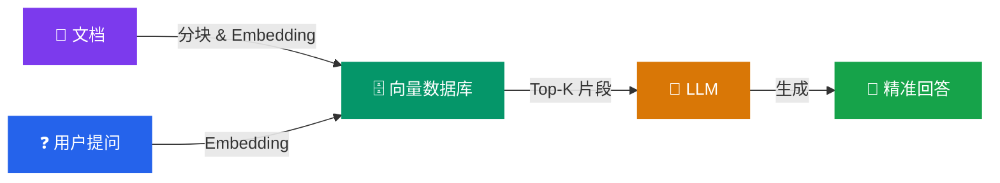
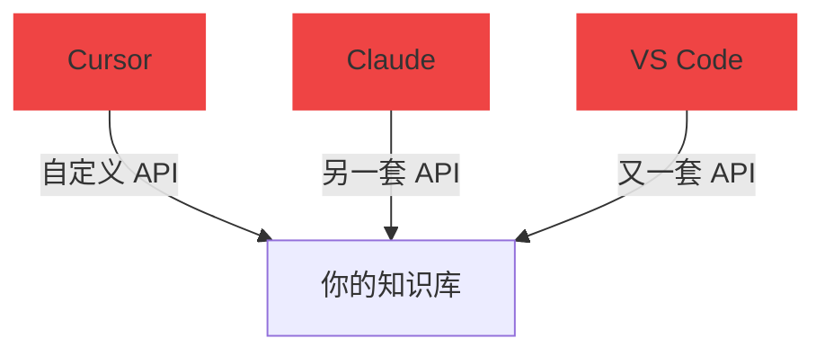
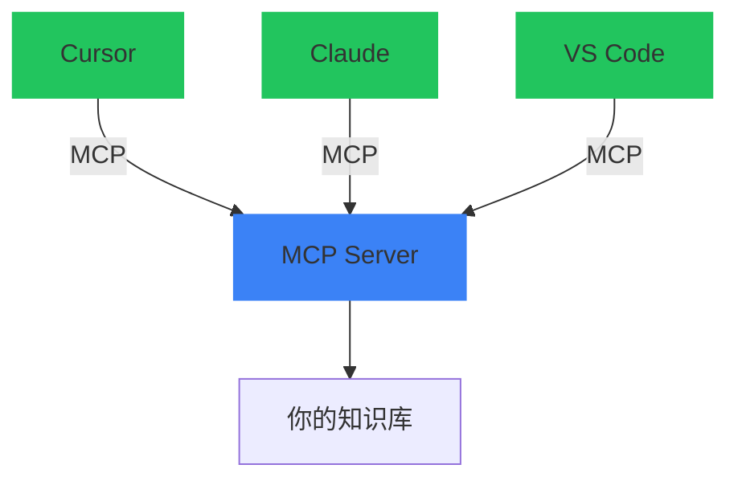
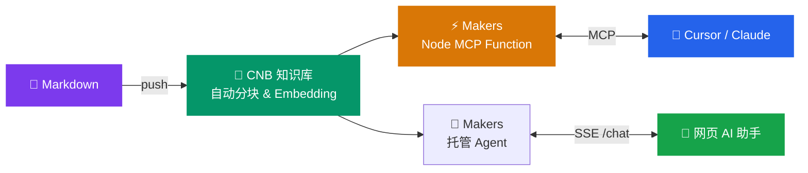

# 让 AI 读懂你的文档

从传统搜索到 RAG 智能检索的进化之路

<div class="pt-8">
  <span class="px-4 py-2 rounded-full bg-gradient-to-r from-blue-500/20 to-purple-500/20 border border-blue-400/30 text-blue-200 text-lg">
    CNB 知识库 × EdgeOne Cloud Function × MCP 协议
  </span>
</div>

<div class="abs-bl m-8 text-left text-sm text-gray-400">
  <div>vector-mcp-edge</div>
  <div class="text-xs mt-1 op-60">cnb.cool/shenzhen/lecturer/vector-mcp-edge</div>
</div>

<style>
h1 {
  background: linear-gradient(135deg, #667eea 0%, #764ba2 100%);
  -webkit-background-clip: text;
  -webkit-text-fill-color: transparent;
  font-size: 3.5em !important;
  font-weight: 800 !important;
}
</style>

---
layout: center
transition: fade-out
---

# 先问一个问题 {.text-transparent.bg-clip-text.bg-gradient-to-r.from-pink-400.to-rose-500}

<div class="text-3xl mt-8 text-gray-300 leading-relaxed">

你的文档站有 **100+ 篇文章**

<v-click>

用户搜索 <span class="text-red-400 font-bold">"怎么部署"</span>

</v-click>
<v-click>

传统搜索返回了 <span class="text-red-400 font-bold">0 条结果</span>

</v-click>
<v-click>

<div class="mt-6 text-2xl">
因为你的文章标题叫 <span class="text-green-400 font-bold">"上线指南"</span> 🤦
</div>

</v-click>
</div>

---

# 传统搜索的困境

<div class="grid grid-cols-2 gap-12 mt-4">
<div>

### 🔍 关键词搜索怎么工作？

<div class="mt-4 p-4 rounded-xl bg-red-500/10 border border-red-500/20">
  <div class="text-sm text-gray-400 mb-2">用户输入</div>
  <div class="text-xl font-mono text-red-400">"怎么部署到服务器"</div>
</div>

<div class="mt-4 text-center text-2xl">⬇️ 逐字匹配</div>

<div class="mt-4 p-4 rounded-xl bg-gray-500/10 border border-gray-500/20">
  <div class="text-sm text-gray-400 mb-2">文档标题</div>
  <div class="font-mono text-gray-500 line-through">"上线指南"</div>
  <div class="font-mono text-gray-500 line-through">"发布流程"</div>
  <div class="font-mono text-gray-500 line-through">"生产环境配置"</div>
  <div class="text-sm text-red-400 mt-2">❌ 没有一个包含"部署"二字</div>
</div>

</div>
<div>

### 💀 核心问题

<v-clicks>

<div class="p-4 rounded-xl bg-gray-800/50 border border-gray-700">
  <div class="text-red-400 font-bold text-lg">同义词盲区</div>
  <div class="text-gray-400 mt-1">"部署" = "上线" = "发布" = "deploy"<br/>但关键词搜索认为它们毫无关系</div>
</div>

<div class="p-4 rounded-xl bg-gray-800/50 border border-gray-700">
  <div class="text-red-400 font-bold text-lg">上下文缺失</div>
  <div class="text-gray-400 mt-1">搜索 "性能优化" 找不到 "减少首屏加载时间"</div>
</div>

<div class="p-4 rounded-xl bg-gray-800/50 border border-gray-700">
  <div class="text-red-400 font-bold text-lg">无法理解意图</div>
  <div class="text-gray-400 mt-1">用户想要的是"答案"，搜索引擎给的是"链接列表"</div>
</div>

</v-clicks>

</div>
</div>

---
layout: center
---

# 如果搜索能 <span class="text-transparent bg-clip-text bg-gradient-to-r from-cyan-400 to-blue-500">"理解"</span> 你的意思呢？

<div class="mt-8 text-xl text-gray-400">
这就是 <strong>RAG</strong>（Retrieval-Augmented Generation）要解决的问题
</div>

---

# 传统搜索 vs RAG 语义检索

<div class="grid grid-cols-2 gap-8 mt-4">
<div class="p-6 rounded-2xl bg-gradient-to-br from-red-500/5 to-red-900/10 border border-red-500/20">

### <span class="text-red-400">🔍 传统关键词搜索</span>

- <span class="text-red-400">✗</span> 基于 **字符串匹配**，逐字比对
- <span class="text-red-400">✗</span> 同义词、近义词完全无法识别
- <span class="text-red-400">✗</span> 返回的是 **文档链接列表**
- <span class="text-red-400">✗</span> 用户需要自己点进去找答案
- <span class="text-red-400">✗</span> 文档越多，噪音越大

```
Q: "怎么部署"
A: 未找到相关结果 😢
```

</div>
<div class="p-6 rounded-2xl bg-gradient-to-br from-green-500/5 to-green-900/10 border border-green-500/20">

### <span class="text-green-400">🧠 RAG 语义检索</span>

- <span class="text-green-400">✓</span> 基于 **向量相似度**，理解语义
- <span class="text-green-400">✓</span> "部署" ≈ "上线" ≈ "发布"，自动关联
- <span class="text-green-400">✓</span> 返回的是 **精准的文档片段**
- <span class="text-green-400">✓</span> LLM 基于片段直接生成答案
- <span class="text-green-400">✓</span> 文档越多，知识越丰富

```
Q: "怎么部署"
A: 根据《上线指南》，你需要先... ✅
```

</div>
</div>

---
layout: center
---

# RAG 是怎么工作的？



<div class="mt-4 grid grid-cols-3 gap-4 text-center text-sm">
  <span class="px-4 py-2 rounded-full bg-purple-500/10 border border-purple-500/30 text-purple-300">① 文档向量化入库</span>
  <span class="px-4 py-2 rounded-full bg-blue-500/10 border border-blue-500/30 text-blue-300">② 语义相似度检索</span>
  <span class="px-4 py-2 rounded-full bg-amber-500/10 border border-amber-500/30 text-amber-300">③ LLM 增强生成回答</span>
</div>

---
layout: center
---

# 听起来很美好，但是... {.text-transparent.bg-clip-text.bg-gradient-to-r.from-pink-400.to-rose-500}

<div class="mt-8 text-2xl text-gray-300 space-y-4">

<v-clicks>

- 自建向量数据库？ **Pinecone / Milvus / Weaviate**
- 编写分块逻辑？ **Token 切分、重叠窗口、语义分段**
- 调用 Embedding 模型？ **OpenAI / Cohere / 自部署**
- 部署 RAG 服务？ **服务器、运维、扩缩容**

</v-clicks>

</div>

<v-click>
<div class="mt-8 text-3xl text-red-400 font-bold text-center">
  我只是想给文档加个智能搜索啊 😭
</div>
</v-click>

---
layout: center
title: 为什么选择 CNB
---

<div class="text-6xl font-black text-transparent bg-clip-text bg-gradient-to-r from-cyan-400 via-blue-500 to-purple-600">
  这就是为什么我们选择 CNB
</div>

<div class="mt-6 text-xl text-gray-400">
  一行配置，替代整套向量化基础设施
</div>

---

# 为什么用 CNB？

<div class="grid grid-cols-2 gap-10 mt-4">
<div>

### 😰 传统方案：你需要做这些

<v-clicks>

<div class="p-3 rounded-lg bg-red-500/10 border border-red-500/20 flex items-center gap-3">
  <span class="text-2xl">🗄️</span>
  <div><div class="font-bold text-red-400">搭建向量数据库</div><div class="text-gray-500 text-sm">Pinecone / Milvus / Weaviate</div></div>
</div>

<div class="p-3 rounded-lg bg-red-500/10 border border-red-500/20 flex items-center gap-3">
  <span class="text-2xl">✂️</span>
  <div><div class="font-bold text-red-400">编写文档分块逻辑</div><div class="text-gray-500 text-sm">Token 切分、重叠窗口、语义分段</div></div>
</div>

<div class="p-3 rounded-lg bg-red-500/10 border border-red-500/20 flex items-center gap-3">
  <span class="text-2xl">🔢</span>
  <div><div class="font-bold text-red-400">调用 Embedding 模型</div><div class="text-gray-500 text-sm">OpenAI / Cohere / 自部署模型</div></div>
</div>

<div class="p-3 rounded-lg bg-red-500/10 border border-red-500/20 flex items-center gap-3">
  <span class="text-2xl">🔄</span>
  <div><div class="font-bold text-red-400">维护索引更新流水线</div><div class="text-gray-500 text-sm">文档变更 → 重新分块 → 重新 Embedding</div></div>
</div>

<div class="p-3 rounded-lg bg-red-500/10 border border-red-500/20 flex items-center gap-3">
  <span class="text-2xl">💰</span>
  <div><div class="font-bold text-red-400">持续付费</div><div class="text-gray-500 text-sm">向量数据库 + Embedding API + 服务器</div></div>
</div>

</v-clicks>

</div>
<div>

### 🎉 CNB 方案：你只需要这些

<div class="mt-4 p-6 rounded-2xl bg-gradient-to-br from-green-500/10 to-cyan-500/10 border border-green-500/30">

📄 `.cnb.yml` — 就这么多

```yaml
main:
  push:
    - name: "向量化数据"
      stages:
        - name: build knowledge base
          image: cnbcool/knowledge-base
          settings:
            include: "**/**.md"
```

<div class="mt-4 text-sm space-y-1">

- [✓]{.text-green-400} 自动分块
- [✓]{.text-green-400} 自动 Embedding
- [✓]{.text-green-400} 自动索引构建
- [✓]{.text-green-400} Push 即触发更新
- [✓]{.text-green-400} 内置语义查询 API

</div>
</div>

<div class="mt-4 p-4 rounded-xl bg-cyan-500/10 border border-cyan-500/20 text-center">
  <div class="text-3xl font-bold text-cyan-400">0 行代码</div>
  <div class="text-sm text-gray-400 mt-1">完成整套向量化基础设施</div>
</div>

</div>
</div>

---

# CNB 的独特优势

| 能力 | CNB 平台 | 传统自建 |
|------|---------|--------|
| **向量化** | 几行配置，push 自动触发 | 自建 Embedding 流水线 |
| **存储 & 查询** | 平台内置，REST API 开箱即用 | Pinecone / Milvus + 自封装 |
| **文档更新** | Git push 自动增量更新 | 手动触发或编写 CI/CD |
| **鉴权 & AI** | Token 自动注入 + 内置 LLM | 手动管理 Key + 第三方 API |
| **成本** | 🆓 免费 | 💰 向量库 + Embedding + 服务器 |

<div class="mt-6 p-4 rounded-xl bg-gradient-to-r from-blue-500/10 to-purple-500/10 border border-blue-500/20 text-center text-lg">
🎯 CNB 不只是代码托管 — 它是 <strong class="text-transparent bg-clip-text bg-gradient-to-r from-blue-400 to-purple-400">代码托管 + 知识库 + AI + CI/CD</strong> 的一站式平台
</div>

---
layout: center
title: 服务部署在哪里
---

<div class="text-5xl font-black">
知识库有了，<span class="text-transparent bg-clip-text bg-gradient-to-r from-amber-400 to-orange-500">服务部署在哪？</span>
</div>

<div class="mt-6 text-xl text-gray-400">
  你需要一个地方来运行 MCP Server 和托管 Agent
</div>

---

# 为什么用 EdgeOne Makers？

<div class="grid grid-cols-3 gap-6 mt-6">

<div class="p-6 rounded-2xl bg-gradient-to-b from-red-500/10 to-transparent border border-red-500/20 text-center">
  <div class="text-4xl mb-3">🖥️</div>

  **传统服务器** {.text-red-400}

  <div class="mt-3 text-sm text-gray-400 space-y-1">
    <div>买服务器 💰</div><div>配环境 🔧</div><div>装 Nginx ⚙️</div>
    <div>SSL 证书 🔒</div><div>监控告警 📊</div><div>扩缩容 📈</div>
  </div>

  **运维地狱 😱** {.text-red-400.mt-3}
</div>

<div class="p-6 rounded-2xl bg-gradient-to-b from-yellow-500/10 to-transparent border border-yellow-500/20 text-center">
  <div class="text-4xl mb-3">☁️</div>

  **Serverless 函数** {.text-yellow-400}

  <div class="mt-3 text-sm text-gray-400 space-y-1">
    <div>冷启动延迟 🐌</div><div>语言限制 🚫</div><div>调试困难 🐛</div>
    <div>厂商锁定 🔗</div><div>单区域部署 📍</div><div>流量费用 💸</div>
  </div>

  **还行但不够 🤔** {.text-yellow-400.mt-3}
</div>

<div class="p-6 rounded-2xl bg-gradient-to-b from-green-500/10 to-transparent border border-green-500/20 text-center relative overflow-hidden">
  <div class="absolute top-2 right-2 px-2 py-0.5 bg-green-500 text-white text-xs rounded-full font-bold">推荐</div>
  <div class="text-4xl mb-3">⚡</div>

  **EdgeOne Makers** {.text-green-400}

  <div class="mt-3 text-sm text-gray-400 space-y-1">
    <div>零服务器 🎉</div><div>Cloud Function + Agent 🚀</div><div>全球边缘网络 🌍</div>
    <div>延迟 < 50ms ⚡</div><div>自动扩缩容 📈</div><div>Git 推送即部署 🔄</div>
  </div>

  **完美方案 ✨** {.text-green-400.mt-3}
</div>

</div>

---

# EdgeOne Makers 的杀手级特性

<div class="grid grid-cols-2 gap-4 mt-6">

<div class="flex items-center gap-4 p-4 rounded-2xl bg-gradient-to-r from-blue-500/5 to-transparent border border-blue-500/20">
  <div class="text-4xl">🌍</div>
  <div>
    <div class="text-lg font-bold text-blue-400">全球边缘网络</div>
    <div class="text-gray-400 text-sm mt-1">3200+ 节点，400 Tbps 带宽，延迟 < 50ms</div>
  </div>
</div>

<div class="flex items-center gap-4 p-4 rounded-2xl bg-gradient-to-r from-green-500/5 to-transparent border border-green-500/20">
  <div class="text-4xl">🔧</div>
  <div>
    <div class="text-lg font-bold text-green-400">托管 Agent</div>
    <div class="text-gray-400 text-sm mt-1">AI Gateway、会话 Store、工具调用与 SSE</div>
  </div>
</div>

<div class="flex items-center gap-4 p-4 rounded-2xl bg-gradient-to-r from-purple-500/5 to-transparent border border-purple-500/20">
  <div class="text-4xl">🔑</div>
  <div>
    <div class="text-lg font-bold text-purple-400">CNB Token 自动注入</div>
    <div class="text-gray-400 text-sm mt-1">无需手动管理密钥，天然打通知识库</div>
  </div>
</div>

<div class="flex items-center gap-4 p-4 rounded-2xl bg-gradient-to-r from-amber-500/5 to-transparent border border-amber-500/20">
  <div class="text-4xl">🚀</div>
  <div>
    <div class="text-lg font-bold text-amber-400">Git Push 即部署</div>
    <div class="text-gray-400 text-sm mt-1">自动构建、部署、分发到全球节点，零运维</div>
  </div>
</div>

</div>

---
layout: center
---

# 还有一个关键问题

<div class="mt-6 text-2xl text-gray-300">
AI 工具怎么 <span class="text-transparent bg-clip-text bg-gradient-to-r from-cyan-400 to-blue-500 font-bold">接入</span> 你的知识库？
</div>

<div class="mt-6 text-6xl">🔌</div>

<div class="mt-4 text-3xl font-bold text-transparent bg-clip-text bg-gradient-to-r from-cyan-400 to-purple-500">
  MCP — Model Context Protocol
</div>

---

# MCP：AI 工具的 "USB 接口"

<div class="grid grid-cols-2 gap-10 mt-4">
<div>

### 没有 MCP 的世界



<div class="text-sm text-red-400 text-center">每个工具都要单独适配 😩</div>

</div>
<div>

### 有 MCP 的世界



<div class="text-sm text-green-400 text-center">一个标准协议，所有工具通用 🎉</div>

</div>
</div>

<div class="mt-4 p-4 rounded-xl bg-gradient-to-r from-blue-500/10 to-purple-500/10 border border-blue-500/20 text-center">
MCP 就像 USB — 你不需要为每个设备设计不同的接口，<strong>一个标准协议连接一切</strong>
</div>

---
layout: center
---

# 把它们串起来



<div class="flex justify-center gap-6 mt-4 text-sm">
  <span class="px-4 py-2 rounded-full bg-indigo-500/20 text-indigo-300">CNB 负责向量化</span>
  <span class="px-4 py-2 rounded-full bg-amber-500/20 text-amber-300">EdgeOne 负责服务</span>
  <span class="px-4 py-2 rounded-full bg-green-500/20 text-green-300">MCP 负责连接</span>
</div>

---

# 一个 Makers 项目，三种能力

<div class="grid grid-cols-3 gap-6 mt-6">

<div class="p-6 rounded-2xl bg-gradient-to-b from-blue-500/10 to-transparent border border-blue-500/30 relative">
  <div class="absolute -top-3 left-4 px-3 py-0.5 bg-blue-500 text-white text-xs rounded-full font-bold">MCP</div>
  <div class="text-4xl mt-2 mb-3 text-center">🔌</div>
  <div class="text-center font-bold text-blue-400 text-lg">/mcp</div>
  <div class="text-center text-sm text-gray-400 mt-1">标准 MCP Streamable HTTP</div>
  <div class="mt-3 text-xs text-gray-500 space-y-1">
    <div>→ Cursor / Claude Desktop</div>
    <div>→ VS Code Copilot</div>
    <div>→ 任何 MCP 客户端</div>
  </div>
</div>

<div class="p-6 rounded-2xl bg-gradient-to-b from-green-500/10 to-transparent border border-green-500/30 relative">
  <div class="absolute -top-3 left-4 px-3 py-0.5 bg-green-500 text-white text-xs rounded-full font-bold">Agent</div>
  <div class="text-4xl mt-2 mb-3 text-center">💬</div>
  <div class="text-center font-bold text-green-400 text-lg">/chat</div>
  <div class="text-center text-sm text-gray-400 mt-1">托管 Agent SSE 问答</div>
  <div class="mt-3 text-xs text-gray-500 space-y-1">
    <div>→ 网页端 AI 助手</div>
    <div>→ AI Gateway + Store</div>
    <div>→ 多轮会话与停止运行</div>
  </div>
</div>

<div class="p-6 rounded-2xl bg-gradient-to-b from-purple-500/10 to-transparent border border-purple-500/30 relative">
  <div class="absolute -top-3 left-4 px-3 py-0.5 bg-purple-500 text-white text-xs rounded-full font-bold">Knowledge Tool</div>
  <div class="text-4xl mt-2 mb-3 text-center">🔧</div>
  <div class="text-center font-bold text-purple-400 text-lg">query_knowledge_base</div>
  <div class="text-center text-sm text-gray-400 mt-1">Agent 内部工具调用</div>
  <div class="mt-3 text-xs text-gray-500 space-y-1">
    <div>→ Agent 自动选择工具</div>
    <div>→ CNB 语义检索</div>
    <div>→ 前端无需手工编排</div>
  </div>
</div>

</div>

<div class="mt-4 text-center text-gray-400">
以前需要 <span class="text-red-400 line-through">浏览器 Tool Calling + Go 模型服务</span> → 现在 <span class="text-green-400 font-bold">Makers 托管 Agent 直接完成</span>
</div>

---

# 总结：为什么是这套方案？

<div class="mt-4 space-y-4">

<v-clicks>

<div class="flex items-center gap-4 p-4 rounded-2xl bg-gradient-to-r from-red-500/5 via-transparent to-green-500/5 border border-gray-700">
  <div class="text-2xl">🧠</div>
  <div class="flex-1">
    <strong>为什么需要这个？</strong>
    <span class="text-gray-400 text-sm ml-2">关键词搜索无法理解语义 → RAG 让搜索真正"懂"你的文档</span>
  </div>
</div>

<div class="flex items-center gap-4 p-4 rounded-2xl bg-gradient-to-r from-red-500/5 via-transparent to-green-500/5 border border-gray-700">
  <div class="text-2xl">📦</div>
  <div class="flex-1">
    <strong>为什么用 CNB？</strong>
    <span class="text-gray-400 text-sm ml-2">自建向量库太重 → 一行配置搞定分块、Embedding、索引</span>
  </div>
</div>

<div class="flex items-center gap-4 p-4 rounded-2xl bg-gradient-to-r from-red-500/5 via-transparent to-green-500/5 border border-gray-700">
  <div class="text-2xl">⚡</div>
  <div class="flex-1">
    <strong>为什么用 EdgeOne？</strong>
    <span class="text-gray-400 text-sm ml-2">零服务器、全球加速、Go 原生支持，Git Push 即部署</span>
  </div>
</div>

<div class="flex items-center gap-4 p-4 rounded-2xl bg-gradient-to-r from-red-500/5 via-transparent to-green-500/5 border border-gray-700">
  <div class="text-2xl">🔌</div>
  <div class="flex-1">
    <strong>为什么用 MCP？</strong>
    <span class="text-gray-400 text-sm ml-2">一个标准协议，Cursor / Claude / VS Code 通吃</span>
  </div>
</div>

</v-clicks>

</div>

---
layout: center
---

# 最终效果

<div class="grid grid-cols-2 gap-8 mt-6 text-left">

<div class="p-6 rounded-2xl bg-gradient-to-br from-blue-500/10 to-purple-500/10 border border-blue-500/20">

### 🤖 AI 编辑器中

```json
// .cursor/mcp.json
{
  "mcpServers": {
    "my-docs": {
      "url": "https://xxx.mintimate.cn/mcp"
    }
  }
}
```

配置一行 URL，AI 就能检索你的全部文档 ✨

</div>

<div class="p-6 rounded-2xl bg-gradient-to-br from-green-500/10 to-cyan-500/10 border border-green-500/20">

### 💬 网页端

<div class="p-3 rounded-lg bg-black/30 text-sm">
  <div class="text-gray-500 mb-2">用户提问：</div>
  <div class="text-white">"怎么部署到 EdgeOne？"</div>
  <div class="text-gray-500 mt-3 mb-2">AI 回答：</div>
  <div class="text-green-300">"根据文档，你需要先在 edgeone.json 中配置构建命令，然后通过 Git 推送触发自动部署..."</div>
</div>

网页右上角 AI 助手，实时流式回答 ✨

</div>
</div>

---
layout: center
---

# 三步上线

<div class="text-xl text-gray-400 mb-8">从写完文档到 AI 能检索，你只需要</div>

<div class="flex justify-center items-center gap-4">

<div class="p-6 rounded-2xl bg-indigo-500/10 border border-indigo-500/30 text-center w-48">
  <div class="text-3xl mb-2">📝</div>
  <div class="font-bold text-indigo-400">写 .cnb.yml</div>
  <div class="text-xs text-gray-500 mt-1">5 行配置</div>
</div>

<div class="text-3xl text-gray-600">→</div>

<div class="p-6 rounded-2xl bg-amber-500/10 border border-amber-500/30 text-center w-48">
  <div class="text-3xl mb-2">📂</div>
  <div class="font-bold text-amber-400">添加服务代码</div>
  <div class="text-xs text-gray-500 mt-1">agents/ + cloud-functions/</div>
</div>

<div class="text-3xl text-gray-600">→</div>

<div class="p-6 rounded-2xl bg-green-500/10 border border-green-500/30 text-center w-48">
  <div class="text-3xl mb-2">🚀</div>
  <div class="font-bold text-green-400">Git Push</div>
  <div class="text-xs text-gray-500 mt-1">自动部署上线</div>
</div>

</div>

<div class="mt-10 text-4xl font-bold text-transparent bg-clip-text bg-gradient-to-r from-cyan-400 via-blue-500 to-purple-600">
  就这么简单。
</div>

---
layout: center
---

# 感谢聆听 {.text-transparent.bg-clip-text.bg-gradient-to-r.from-indigo-400.to-purple-500}

<div class="mt-4 text-xl text-gray-400">让每一份文档都能被 AI 理解</div>

<div class="mt-10 flex justify-center gap-6">
  <a href="https://cnb.cool/shenzhen/lecturer/vector-mcp-edge" target="_blank" class="px-6 py-3 rounded-full bg-gradient-to-r from-blue-500 to-purple-500 text-white font-bold no-underline hover:op-80 transition">📖 查看项目</a>
  <a href="https://vector-mcp-edge.mintimate.cn" target="_blank" class="px-6 py-3 rounded-full bg-gradient-to-r from-green-500 to-cyan-500 text-white font-bold no-underline hover:op-80 transition">🎯 在线体验</a>
</div>

<div class="mt-10 text-sm text-gray-600">
CNB 平台知识库 × EdgeOne Makers Agent × MCP 协议
</div>
